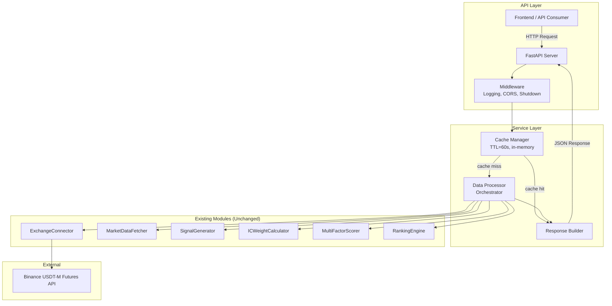
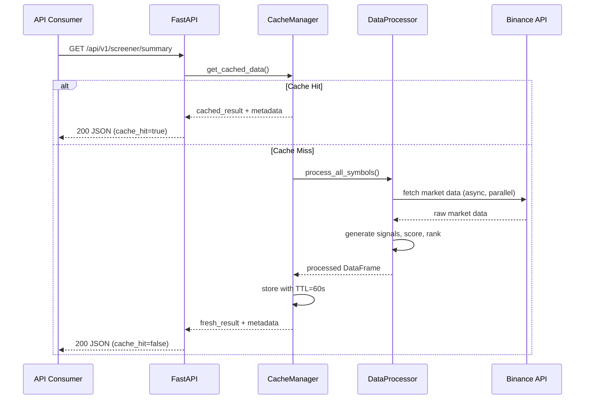
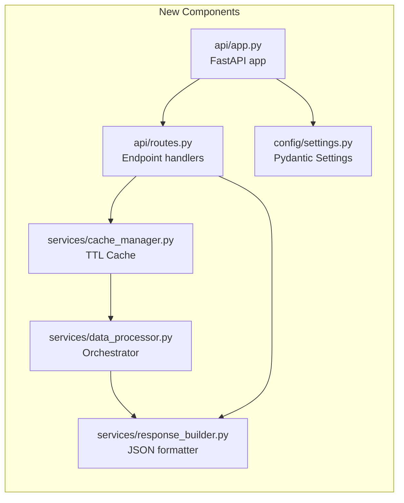
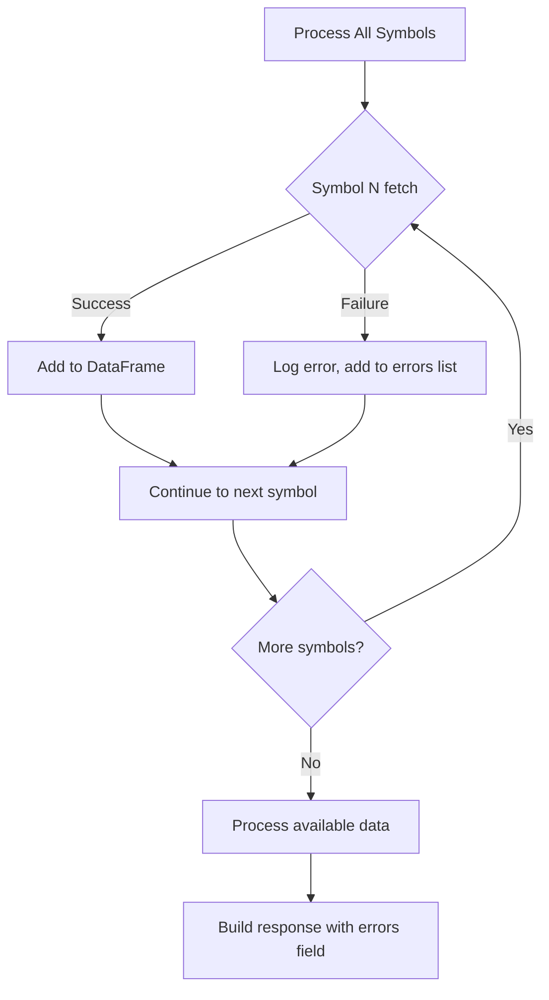

# Design Document: API Backend Transformation

## Overview

This design transforms the existing crypto screener application from a standalone script generating matplotlib visualizations into a REST API backend returning JSON data. The transformation preserves all existing data processing modules (exchange connector, market data fetcher, signal generator, IC weight calculator, multi-factor scorer, ranking engine) and wraps them with a FastAPI-based HTTP layer.

The key architectural change is the introduction of a caching layer between the API endpoints and the data processing pipeline, preventing exchange rate limit violations while maintaining data freshness. The API serves pre-computed screener results as structured JSON, enabling any frontend to consume and visualize the data independently.

### Key Design Decisions

1. **FastAPI over Flask/Django**: Chosen for native async support, automatic OpenAPI docs, and Pydantic validation — all critical for a financial data API with strict performance requirements.
2. **In-memory TTL cache**: Simple cachetools-based caching avoids external dependencies (Redis) while meeting the 60-second TTL requirement for a single-instance deployment.
3. **Adapter pattern for existing modules**: Rather than modifying existing modules, a `DataProcessor` adapter orchestrates them and converts DataFrame output to JSON-serializable dictionaries.
4. **Graceful degradation**: Per-symbol error isolation ensures partial data availability when individual exchange calls fail.

## Architecture

### High-Level Architecture



### Request Flow



### Component Interaction



## Components and Interfaces

### 1. FastAPI Application (`api/app.py`)

**Responsibility**: Application factory, middleware registration, lifespan management.

```python
# Interface
class create_app() -> FastAPI:
    """Create and configure the FastAPI application."""
    pass
```

- Registers CORS middleware
- Registers request logging middleware
- Manages graceful shutdown via lifespan context manager
- Includes API router with `/api/v1` prefix

### 2. API Routes (`api/routes.py`)

**Responsibility**: HTTP endpoint definitions, request validation, response formatting.

```python
@router.get("/screener/summary")
async def get_screener_summary(summary_only: bool = False) -> ScreenerResponse:
    """Return full screener data or summary-only."""
    pass

@router.get("/screener/assets/{symbol}")
async def get_asset_detail(symbol: str) -> AssetDetailResponse:
    """Return detailed data for a single asset."""
    pass

@router.get("/health")
async def health_check() -> HealthResponse:
    """Return API health status."""
    pass
```

### 3. Data Processor (`services/data_processor.py`)

**Responsibility**: Orchestrates existing modules to produce ranked screener data.

```python
class DataProcessor:
    def __init__(self, symbols: list[str], exchange_id: str = 'binanceusdm'):
        pass

    async def process_all(self) -> ProcessedResult:
        """Execute full pipeline: connect → fetch → signal → score → rank."""
        pass

    async def _fetch_with_error_isolation(self) -> tuple[pd.DataFrame, list[str]]:
        """Fetch data for all symbols, isolating per-symbol errors."""
        pass
```

- Wraps synchronous existing modules in `asyncio.to_thread()` for non-blocking execution
- Collects per-symbol errors without halting the pipeline
- Returns both the ranked DataFrame and error list

### 4. Cache Manager (`services/cache_manager.py`)

**Responsibility**: TTL-based in-memory caching of processed results.

```python
class CacheManager:
    def __init__(self, ttl_seconds: int = 60):
        pass

    def get(self) -> Optional[CacheEntry]:
        """Return cached data if valid, None if expired."""
        pass

    def set(self, data: ProcessedResult) -> None:
        """Store processed result with current timestamp."""
        pass

    @property
    def data_age_seconds(self) -> float:
        """Seconds since last cache write."""
        pass

    @property
    def is_stale(self) -> bool:
        """True if data_age_seconds > 300."""
        pass

    @property
    def next_refresh_at(self) -> datetime:
        """Timestamp when cache will expire."""
        pass
```

### 5. Response Builder (`services/response_builder.py`)

**Responsibility**: Converts processed DataFrames into JSON-serializable response structures.

```python
class ResponseBuilder:
    def build_full_response(
        self, 
        data: pd.DataFrame, 
        errors: list[str],
        cache_hit: bool,
        fetched_at: datetime,
        data_age_seconds: float
    ) -> dict:
        """Build complete screener response with metadata, summary, and assets."""
        pass

    def build_summary_only(self, data: pd.DataFrame, ...) -> dict:
        """Build response with metadata and summary, omitting assets array."""
        pass

    def build_asset_detail(self, row: pd.Series) -> dict:
        """Build single asset detail response."""
        pass

    def _sanitize_value(self, value) -> Any:
        """Convert NaN/None to null, format numeric precision."""
        pass
```

### 6. Configuration (`config/settings.py`)

**Responsibility**: Centralized configuration via Pydantic BaseSettings.

```python
class Settings(BaseSettings):
    api_host: str = "0.0.0.0"
    api_port: int = 8000
    cache_ttl: int = 60
    log_level: str = "INFO"
    symbols: list[str] = [
        "BTC/USDT:USDT", "ETH/USDT:USDT", "SOL/USDT:USDT",
        "AAVE/USDT:USDT", "LINK/USDT:USDT", "AVAX/USDT:USDT", "DOGE/USDT:USDT"
    ]
    mock_mode: bool = False
    cors_origins: list[str] = ["*"]
    shutdown_timeout: int = 30

    class Config:
        env_prefix = "SCREENER_"
        env_file = ".env"
```

### 7. Logging Setup (`config/logging_config.py`)

**Responsibility**: Structured JSON logging with rotation.

```python
def setup_logging(log_level: str = "INFO") -> None:
    """Configure structured JSON logging with file rotation."""
    pass
```

- JSON format for machine readability
- RotatingFileHandler: max 10 files, 10MB each
- Logs: request/response, cache events, exchange errors

## Data Models

### Pydantic Response Models

```python
from pydantic import BaseModel
from typing import Optional
from datetime import datetime


class ResponseMetadata(BaseModel):
    timestamp: datetime
    symbol_count: int
    data_freshness: str  # "fresh" | "cached" | "stale"
    fetched_at: datetime
    data_age_seconds: float
    cache_hit: bool
    next_refresh_at: datetime
    stale_data_warning: Optional[bool] = None


class MarketOverview(BaseModel):
    avg_change_24h: Optional[float] = None
    avg_funding_rate: Optional[float] = None
    bullish_count: int = 0
    bearish_count: int = 0


class AssetSummary(BaseModel):
    symbol: str
    multi_factor_score: Optional[float] = None
    tier: Optional[str] = None
    rank: Optional[int] = None
    change_24h: Optional[float] = None


class AssetDetail(BaseModel):
    symbol: str
    price: Optional[float] = None
    change_24h: Optional[float] = None
    funding_rate: Optional[float] = None
    long_short_ratio: Optional[float] = None
    momentum_30d: Optional[float] = None
    reversal_signal: Optional[float] = None
    momentum_signal: Optional[float] = None
    multi_factor_score: Optional[float] = None
    tier: Optional[str] = None
    rank: Optional[int] = None
    atr_value: Optional[float] = None
    atr_percent: Optional[float] = None
    distance_to_ma50: Optional[float] = None
    oi_delta_percent: Optional[float] = None
    sparkline_7d: Optional[list[float]] = None


class SummaryData(BaseModel):
    top_3_assets: list[AssetSummary]
    market_overview: MarketOverview


class ScreenerResponse(BaseModel):
    metadata: ResponseMetadata
    summary: SummaryData
    assets: Optional[list[AssetDetail]] = None
    errors: list[str] = []


class AssetDetailResponse(BaseModel):
    metadata: ResponseMetadata
    asset: AssetDetail
    errors: list[str] = []


class HealthResponse(BaseModel):
    status: str  # "healthy" | "degraded" | "unhealthy"
    timestamp: datetime
    cache_status: str  # "warm" | "cold" | "stale"
    uptime_seconds: float


class ErrorResponse(BaseModel):
    error: str
    detail: str
    available_symbols: Optional[list[str]] = None
```

### Internal Data Structures

```python
from dataclasses import dataclass, field
from datetime import datetime
import pandas as pd


@dataclass
class ProcessedResult:
    """Output of DataProcessor.process_all()"""
    data: pd.DataFrame
    errors: list[str] = field(default_factory=list)
    processed_at: datetime = field(default_factory=datetime.utcnow)


@dataclass
class CacheEntry:
    """Stored cache item with metadata"""
    result: ProcessedResult
    stored_at: datetime
    ttl_seconds: int

    @property
    def is_expired(self) -> bool:
        age = (datetime.utcnow() - self.stored_at).total_seconds()
        return age > self.ttl_seconds

    @property
    def age_seconds(self) -> float:
        return (datetime.utcnow() - self.stored_at).total_seconds()
```

### Symbol Normalization

The API accepts symbols in multiple formats and normalizes them internally:

| Input Format | Normalized Format | Example |
|---|---|---|
| `BTCUSDT` | `BTC/USDT:USDT` | Short form |
| `BTC/USDT` | `BTC/USDT:USDT` | Spot format |
| `BTC/USDT:USDT` | `BTC/USDT:USDT` | Full futures format |
| `btcusdt` | `BTC/USDT:USDT` | Case-insensitive |

```python
def normalize_symbol(symbol: str, available_symbols: list[str]) -> Optional[str]:
    """Normalize user input to CCXT futures format. Returns None if not found."""
    pass
```

### Project File Structure

```
crypto-screener/
├── src/
│   ├── api/
│   │   ├── __init__.py
│   │   ├── app.py              # FastAPI application factory
│   │   └── routes.py           # API endpoint handlers
│   ├── services/
│   │   ├── __init__.py
│   │   ├── data_processor.py   # Pipeline orchestrator
│   │   ├── cache_manager.py    # TTL cache implementation
│   │   └── response_builder.py # JSON response formatter
│   ├── config/
│   │   ├── __init__.py
│   │   ├── settings.py         # Pydantic BaseSettings
│   │   └── logging_config.py   # Structured logging setup
│   ├── exchange/               # (existing, unchanged)
│   ├── data/                   # (existing, unchanged)
│   ├── signals/                # (existing, unchanged)
│   ├── ranking/                # (existing, unchanged)
│   └── utils/
├── tests/
│   ├── test_api/
│   │   ├── test_routes.py
│   │   └── test_app.py
│   ├── test_services/
│   │   ├── test_data_processor.py
│   │   ├── test_cache_manager.py
│   │   └── test_response_builder.py
│   └── conftest.py             # Shared fixtures, mock mode
├── main_api.py                 # API entry point (uvicorn)
├── main.py                     # (existing, preserved)
├── .env.example
└── requirements.txt            # Updated with FastAPI deps
```


## Correctness Properties

*A property is a characteristic or behavior that should hold true across all valid executions of a system — essentially, a formal statement about what the system should do. Properties serve as the bridge between human-readable specifications and machine-verifiable correctness guarantees.*

### Property 1: Response Structure Completeness

*For any* valid processed DataFrame (with 1 or more rows), the response built by ResponseBuilder SHALL contain all required top-level keys (`metadata`, `summary`, `assets`) where metadata includes `timestamp`, `symbol_count`, `data_freshness`, `fetched_at`, `data_age_seconds`, `cache_hit`, and `next_refresh_at`, and summary includes `top_3_assets` and `market_overview`.

**Validates: Requirements 3.1, 3.2, 3.3, 5.5, 5.6, 7.5, 13.1, 13.4**

### Property 2: Asset Object Completeness

*For any* asset row in a processed DataFrame, the corresponding asset object in the response SHALL contain all metric fields: `symbol`, `price`, `change_24h`, `funding_rate`, `long_short_ratio`, `momentum_30d`, `reversal_signal`, `momentum_signal`, `multi_factor_score`, `tier`, `rank`.

**Validates: Requirements 3.4**

### Property 3: Value Sanitization

*For any* numeric value in the processed DataFrame, the ResponseBuilder SHALL format it with 2-4 decimal places in the JSON output, and *for any* NaN or None value, the output SHALL be JSON `null`.

**Validates: Requirements 3.5, 3.6**

### Property 4: Invalid Symbol Rejection

*For any* string that is not in the configured SYMBOLS list (after normalization), a request to `/api/v1/screener/assets/{symbol}` SHALL return HTTP 404 with a response body containing an `error` message matching the format "Symbol {symbol} not found. Available symbols: [list]" and an `available_symbols` field listing all valid symbols.

**Validates: Requirements 4.5, 14.1, 14.2, 14.3**

### Property 5: Cache TTL Correctness

*For any* stored cache entry, retrieving it before TTL seconds have elapsed SHALL return the cached data (cache_hit=true), and retrieving it after TTL seconds have elapsed SHALL trigger a fresh data fetch (cache_hit=false).

**Validates: Requirements 5.1, 5.2, 5.3**

### Property 6: Partial Failure Isolation

*For any* subset of symbols that fail during data fetching, the DataProcessor SHALL still return valid processed data for all remaining symbols, and the ResponseBuilder SHALL set all metric fields to null for the failed symbols while preserving correct values for successful symbols.

**Validates: Requirements 7.1, 7.2**

### Property 7: Summary-Only Filter

*For any* request with query parameter `summary_only=true`, the response SHALL contain `metadata` and `summary` but SHALL NOT contain the `assets` field (or it shall be null), regardless of how many assets were processed.

**Validates: Requirements 12.3, 12.4**

### Property 8: Stale Data Warning

*For any* response where `data_age_seconds` exceeds 300, the metadata SHALL include `stale_data_warning` set to `true`. *For any* response where `data_age_seconds` is 300 or less, `stale_data_warning` SHALL be absent or `null`.

**Validates: Requirements 13.3**

### Property 9: Symbol Normalization

*For any* valid symbol expressed in any accepted format (e.g., "BTCUSDT", "BTC/USDT", "BTC/USDT:USDT", "btcusdt"), the normalization function SHALL resolve it to the same canonical CCXT futures format, and the resolved symbol SHALL be present in the configured symbols list.

**Validates: Requirements 14.4**

## Error Handling

### Error Categories and HTTP Status Codes

| Error Category | HTTP Status | Condition | Response |
|---|---|---|---|
| Success | 200 | Request processed successfully | Full response body |
| Not Found | 404 | Symbol not in configured list | ErrorResponse with available_symbols |
| Service Unavailable | 503 | Exchange timeout / shutdown in progress | ErrorResponse with retry hint |
| Internal Error | 500 | Unexpected exception | ErrorResponse with generic message |

### Error Isolation Strategy



- **Per-symbol isolation**: Each symbol is fetched independently. A failure in one does not affect others.
- **Error accumulation**: All per-symbol errors are collected in an `errors` array in the response.
- **Null propagation**: Failed symbols appear in the assets array with all metric fields set to `null`.
- **Total failure**: If ALL symbols fail, return 503 with accumulated error details.

### Exchange Error Handling

| Exchange Error | Action |
|---|---|
| `ccxt.NetworkError` | Log, mark symbol as failed, continue |
| `ccxt.ExchangeError` | Log, mark symbol as failed, continue |
| `ccxt.RateLimitExceeded` | Log warning, return cached data if available, else 503 |
| Connection timeout | Return 503 "Service temporarily unavailable" |

### Graceful Shutdown Sequence

1. Receive SIGTERM/SIGINT
2. Set `shutting_down = True` flag
3. Middleware rejects new requests with 503
4. Wait for active requests to complete (max 30s timeout)
5. Close exchange connections
6. Flush logs
7. Exit process

## Testing Strategy

### Testing Approach

This feature uses a dual testing approach:

1. **Property-based tests** (using `hypothesis` library): Verify universal correctness properties across randomly generated inputs. Each property test runs minimum 100 iterations.
2. **Unit tests** (using `pytest`): Verify specific examples, edge cases, integration points, and error conditions.
3. **Integration tests**: Verify end-to-end behavior with mocked exchange responses.

### Property-Based Testing Configuration

- **Library**: [Hypothesis](https://hypothesis.readthedocs.io/) for Python
- **Minimum iterations**: 100 per property
- **Tag format**: `# Feature: api-backend-transformation, Property {N}: {title}`

### Test Plan

| Component | Test Type | What's Verified |
|---|---|---|
| ResponseBuilder.build_full_response | Property | Properties 1, 2, 3 |
| ResponseBuilder (summary_only) | Property | Property 7 |
| ResponseBuilder (stale warning) | Property | Property 8 |
| CacheManager get/set/expiry | Property | Property 5 |
| normalize_symbol | Property | Property 9 |
| API routes (invalid symbol) | Property | Property 4 |
| DataProcessor (partial failure) | Property | Property 6 |
| API routes (health, summary) | Unit/Example | Endpoints return correct status |
| Configuration defaults | Unit/Example | Default values applied |
| Logging output | Unit/Example | Structured JSON format |
| CORS headers | Unit/Example | Headers present |
| Graceful shutdown | Integration | Active requests complete |
| Exchange timeout | Integration | 503 returned |
| Full pipeline (mock mode) | Integration | End-to-end data flow |

### Test Dependencies

```
pytest>=7.4.0
pytest-asyncio>=0.23.0
hypothesis>=6.92.0
httpx>=0.25.0  # For async test client
pytest-cov>=4.1.0
```

### Mock Mode for Testing

The `mock_mode` configuration flag enables testing without exchange connectivity:
- `DataProcessor` returns synthetic DataFrame with realistic values
- All metric columns populated with random but valid data
- Enables CI/CD pipeline testing without API keys or network access
