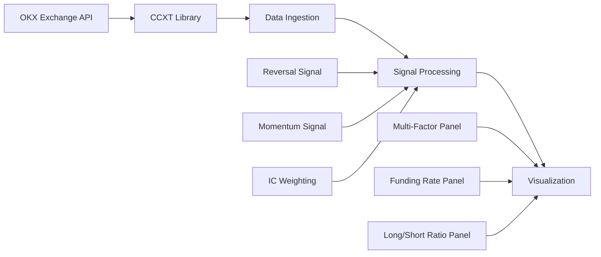
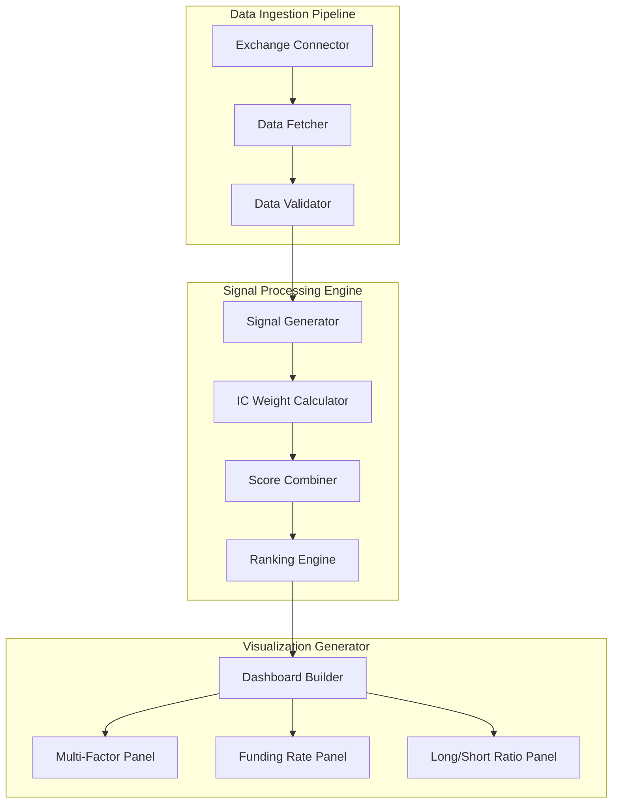

# Technical Design Document: Crypto Screener System

## Overview

The Crypto Screener System is a real-time cryptocurrency asset analysis tool that fetches market data from exchanges, applies quantitative scoring algorithms, and generates static visualization dashboards. The system is designed as a self-contained Python application that processes perpetual futures data from OKX exchange, calculates multi-factor scores combining reversal and momentum signals, and produces horizontal bar chart visualizations showing composite scores, funding rates, and long/short ratios.

### Key Design Decisions

1. **Exchange Selection**: OKX is used as the primary data source instead of Binance to accommodate regional access restrictions
2. **Static Visualization**: The system generates static matplotlib/seaborn charts rather than interactive dashboards, prioritizing simplicity and portability
3. **Simulated Signals**: Initial implementation uses simulated IC weights and signal generation logic, providing a framework for future integration of real quantitative models
4. **Self-Contained Script**: The entire system is implemented as a single executable Python script to minimize deployment complexity
5. **Graceful Degradation**: Missing data for individual assets does not halt processing, allowing partial results to be displayed

## Architecture

### System Architecture

The system follows a pipeline architecture with three main stages:



### Component Architecture



### Technology Stack

- **Language**: Python 3.8+
- **Exchange Integration**: CCXT library
- **Data Processing**: pandas, numpy
- **Visualization**: matplotlib, seaborn
- **Data Structures**: pandas DataFrame for tabular data storage

## Components and Interfaces

### 1. Data Ingestion Pipeline

**Responsibility**: Fetch real-time market data from OKX exchange for specified perpetual futures contracts.

**Key Classes/Functions**:

```python
class ExchangeConnector:
    """Manages connection to OKX exchange via CCXT"""
    
    def __init__(self, exchange_id: str = 'okx'):
        """Initialize CCXT exchange instance"""
        
    def connect(self) -> bool:
        """Establish connection and validate exchange availability"""
        
    def get_exchange(self) -> ccxt.Exchange:
        """Return configured exchange instance"""

class MarketDataFetcher:
    """Fetches market data for perpetual futures"""
    
    def __init__(self, exchange: ccxt.Exchange, symbols: List[str]):
        """Initialize with exchange and symbol list"""
        
    def fetch_ticker_data(self, symbol: str) -> Dict[str, Any]:
        """Fetch current price and 24h change for a symbol"""
        
    def fetch_funding_rate(self, symbol: str) -> float:
        """Fetch current funding rate percentage"""
        
    def fetch_long_short_ratio(self, symbol: str) -> float:
        """Fetch current long/short ratio"""
        
    def fetch_all_data(self) -> pd.DataFrame:
        """Fetch all data fields for all symbols, return as DataFrame"""
```

**Interface Contract**:
- Input: List of asset symbols (e.g., ['ZEC/USDT:USDT', 'TAO/USDT:USDT'])
- Output: pandas DataFrame with columns: symbol, price, change_24h, funding_rate, long_short_ratio
- Error Handling: Returns partial data with null values for failed fetches, logs errors

**CCXT Endpoint Mapping**:
- Price & 24h Change: `exchange.fetch_ticker(symbol)` → `ticker['last']`, `ticker['percentage']`
- Funding Rate: `exchange.fetch_funding_rate(symbol)` → `funding_rate['fundingRate']`
- Long/Short Ratio: Custom endpoint or simulated (OKX-specific API may be needed)

### 2. Signal Processing Engine

**Responsibility**: Generate quantitative trading signals and calculate multi-factor scores.

**Key Classes/Functions**:

```python
class SignalGenerator:
    """Generates trading signals from market data"""
    
    def calculate_reversal_signal(self, df: pd.DataFrame) -> pd.Series:
        """
        Calculate 1-day reversal signal
        Simulated logic: -1 * change_24h (negative of recent move)
        """
        
    def calculate_momentum_signal(self, df: pd.DataFrame) -> pd.Series:
        """
        Calculate 30-day momentum signal
        Simulated logic: change_24h * random_factor (placeholder)
        """
        
    def normalize_signal(self, signal: pd.Series) -> pd.Series:
        """Z-score normalization: (x - mean) / std"""

class ICWeightCalculator:
    """Manages Information Coefficient weights for signals"""
    
    def __init__(self):
        """Initialize with simulated IC weights"""
        self.weights = {
            'reversal_1d': 0.3,
            'momentum_30d': 0.7
        }
        
    def get_weight(self, signal_name: str) -> float:
        """Return IC weight for a signal"""

class MultiFactorScorer:
    """Combines signals into multi-factor score"""
    
    def __init__(self, ic_calculator: ICWeightCalculator):
        """Initialize with IC weight calculator"""
        
    def calculate_score(self, df: pd.DataFrame) -> pd.Series:
        """
        Calculate weighted combination of normalized signals
        score = w1 * signal1 + w2 * signal2
        """
        
    def classify_tiers(self, scores: pd.Series) -> pd.Series:
        """
        Classify scores into Tier A (top 50%) and Tier B (bottom 50%)
        """

class RankingEngine:
    """Ranks assets by multi-factor score"""
    
    def rank_assets(self, df: pd.DataFrame) -> pd.DataFrame:
        """Sort DataFrame by multi_factor_score descending"""
```

**Interface Contract**:
- Input: pandas DataFrame with market data
- Output: pandas DataFrame with additional columns: reversal_signal, momentum_signal, multi_factor_score, tier
- Signal Normalization: All signals are z-score normalized before combination
- Score Calculation: `score = 0.3 * reversal_signal + 0.7 * momentum_signal`

### 3. Visualization Generator

**Responsibility**: Create static dashboard with three horizontal bar chart panels.

**Key Classes/Functions**:

```python
class DashboardBuilder:
    """Builds complete visualization dashboard"""
    
    def __init__(self, df: pd.DataFrame):
        """Initialize with ranked DataFrame"""
        
    def create_dashboard(self) -> matplotlib.figure.Figure:
        """Create 3-panel horizontal bar chart figure"""
        
    def save_dashboard(self, filepath: str):
        """Save figure to disk"""

class MultiFactorPanel:
    """Renders multi-factor score panel"""
    
    def render(self, ax: matplotlib.axes.Axes, df: pd.DataFrame):
        """
        Create horizontal bar chart with:
        - Y-axis: Asset symbols (ordered by score)
        - X-axis: Multi-factor score
        - Colors: Tier A (#C85A82), Tier B (lighter shade)
        - Labels: Numeric score values on bars
        """

class FundingRatePanel:
    """Renders funding rate panel"""
    
    def render(self, ax: matplotlib.axes.Axes, df: pd.DataFrame):
        """
        Create horizontal bar chart with:
        - Y-axis: Asset symbols (same order as multi-factor)
        - X-axis: Funding rate percentage
        - Reference line: 0% (vertical)
        - Colors: Negative (green/blue), Positive (red/orange)
        """

class LongShortRatioPanel:
    """Renders long/short ratio panel"""
    
    def render(self, ax: matplotlib.axes.Axes, df: pd.DataFrame):
        """
        Create horizontal bar chart with:
        - Y-axis: Asset symbols (same order as multi-factor)
        - X-axis: Long/short ratio
        - Reference lines: 1.0 (neutral), 1.5 (warning)
        - Highlight: Bars exceeding 1.5 threshold
        """
```

**Interface Contract**:
- Input: Ranked pandas DataFrame with all calculated fields
- Output: matplotlib Figure object with 3 subplots
- Layout: Vertical stack of 3 panels sharing Y-axis
- Color Scheme: 
  - Multi-factor: #C85A82 (Tier A), #E8A5B8 (Tier B)
  - Funding Rate: #4CAF50 (negative), #FF5722 (positive)
  - Long/Short: #2196F3 (normal), #FFC107 (warning >1.5)

### 4. Main Orchestrator

**Responsibility**: Coordinate pipeline execution and error handling.

```python
def main():
    """
    Main execution flow:
    1. Validate dependencies (ccxt, pandas, matplotlib)
    2. Initialize exchange connector
    3. Fetch market data for symbol list
    4. Generate signals and calculate scores
    5. Rank assets
    6. Generate visualization
    7. Save dashboard to disk
    """
    
    # Symbol list
    SYMBOLS = ['ZEC/USDT:USDT', 'TAO/USDT:USDT', 'TON/USDT:USDT', 
               'AAVE/USDT:USDT', 'SOL/USDT:USDT']
    
    try:
        # Pipeline execution with error handling at each stage
        pass
    except Exception as e:
        # Log error and exit gracefully
        pass
```

## Data Models

### Market Data Record

```python
@dataclass
class MarketDataRecord:
    """Single asset market data snapshot"""
    symbol: str                    # Asset symbol (e.g., 'ZEC/USDT:USDT')
    price: float                   # Current price
    change_24h: float              # 24-hour percentage change
    funding_rate: Optional[float]  # Funding rate percentage (nullable)
    long_short_ratio: Optional[float]  # Long/short ratio (nullable)
    timestamp: datetime            # Data fetch timestamp
```

### Signal Data Record

```python
@dataclass
class SignalDataRecord:
    """Calculated signals for an asset"""
    symbol: str
    reversal_signal: float         # Normalized 1-day reversal signal
    momentum_signal: float         # Normalized 30-day momentum signal
    multi_factor_score: float      # Weighted combination of signals
    tier: str                      # 'A' or 'B' classification
    rank: int                      # Ranking position (1 = highest score)
```

### Complete DataFrame Schema

The system uses a single pandas DataFrame with the following schema:

| Column | Type | Description | Nullable |
|--------|------|-------------|----------|
| symbol | str | Asset symbol | No |
| price | float | Current price | No |
| change_24h | float | 24h percentage change | No |
| funding_rate | float | Funding rate percentage | Yes |
| long_short_ratio | float | Long/short ratio | Yes |
| reversal_signal | float | Normalized reversal signal | No |
| momentum_signal | float | Normalized momentum signal | No |
| multi_factor_score | float | Composite score | No |
| tier | str | 'A' or 'B' classification | No |
| rank | int | Ranking position | No |

**Data Flow**:
1. Market data columns populated by Data Ingestion Pipeline
2. Signal columns added by Signal Processing Engine
3. Entire DataFrame passed to Visualization Generator

## Correctness Properties


*A property is a characteristic or behavior that should hold true across all valid executions of a system—essentially, a formal statement about what the system should do. Properties serve as the bridge between human-readable specifications and machine-verifiable correctness guarantees.*

### Property 1: Signal Generation Completeness

*For any* valid market data DataFrame containing price and change_24h columns, the signal generation functions SHALL produce reversal and momentum signal values for every asset without raising exceptions.

**Validates: Requirements 3.1, 3.2**

### Property 2: Signal Normalization Correctness

*For any* signal series with at least 2 distinct values, z-score normalization SHALL produce output with mean approximately 0 (within floating point tolerance) and standard deviation approximately 1 (within floating point tolerance).

**Validates: Requirements 3.5**

### Property 3: Multi-Factor Score Calculation

*For any* set of normalized signals and IC weights, the multi-factor score SHALL equal the weighted sum of signals: `score = w1 * signal1 + w2 * signal2 + ... + wn * signaln`.

**Validates: Requirements 3.3, 3.4**

### Property 4: Ranking Order Preservation

*For any* DataFrame with multi-factor scores, the ranking function SHALL produce output sorted in descending order by score, where `score[i] >= score[i+1]` for all consecutive pairs.

**Validates: Requirements 4.1**

### Property 5: Stable Sort Preservation

*For any* DataFrame with duplicate multi-factor scores, the ranking function SHALL preserve the relative order of assets with equal scores (stable sort property).

**Validates: Requirements 4.2**

### Property 6: Tier Classification Consistency

*For any* DataFrame with multi-factor scores, tier classification SHALL assign exactly one tier ('A' or 'B') to each asset based on a consistent threshold rule, with higher scores receiving 'A' classification.

**Validates: Requirements 4.3**

### Property 7: Missing Data Graceful Handling

*For any* DataFrame with null or missing values in optional fields (funding_rate, long_short_ratio), the signal processing pipeline SHALL complete execution without raising exceptions and produce valid multi-factor scores for all assets with required fields.

**Validates: Requirements 2.7, 10.2**

### Property 8: Visualization Order Consistency

*For any* ranked DataFrame, all three visualization panels SHALL display assets in the same order, matching the multi-factor score ranking from highest to lowest.

**Validates: Requirements 5.3**

### Property 9: Tier-Based Color Mapping

*For any* DataFrame with tier classifications, the multi-factor score visualization SHALL apply color #C85A82 to all Tier A assets and a lighter shade to all Tier B assets consistently.

**Validates: Requirements 6.2, 6.3**

### Property 10: Sign-Based Funding Rate Color Mapping

*For any* DataFrame with funding rate values, the funding rate visualization SHALL apply one color scheme to all negative values (indicating short bias) and a different color scheme to all positive values (indicating long bias).

**Validates: Requirements 7.3, 7.4**

### Property 11: Threshold-Based Long/Short Highlighting

*For any* DataFrame with long/short ratio values, the visualization SHALL apply highlighting to all bars where the ratio exceeds 1.5, and standard coloring to all bars at or below 1.5.

**Validates: Requirements 8.4**

## Error Handling

### Error Categories and Strategies

#### 1. Exchange Connection Errors

**Scenario**: CCXT cannot connect to OKX exchange (network issues, API downtime, authentication failure)

**Handling Strategy**:
- Catch `ccxt.NetworkError`, `ccxt.ExchangeError` exceptions during initialization
- Log descriptive error message including exchange name and error details
- Return error to user with actionable message: "Failed to connect to OKX exchange: {error_details}"
- Do not proceed with data fetching

**Implementation**:
```python
try:
    exchange = ccxt.okx()
    exchange.load_markets()
except ccxt.NetworkError as e:
    logger.error(f"Network error connecting to OKX: {e}")
    raise ConnectionError(f"Failed to connect to OKX exchange: {e}")
except ccxt.ExchangeError as e:
    logger.error(f"Exchange error with OKX: {e}")
    raise ConnectionError(f"OKX exchange error: {e}")
```

#### 2. Data Fetching Errors

**Scenario**: Individual symbol data fetch fails (symbol not found, API rate limit, temporary unavailability)

**Handling Strategy**:
- Catch exceptions per-symbol during data fetching loop
- Log error with symbol name and error details
- Set null/NaN values for failed symbol's data fields
- Continue processing remaining symbols
- Include partial results in final DataFrame

**Implementation**:
```python
for symbol in symbols:
    try:
        ticker = exchange.fetch_ticker(symbol)
        # Extract data
    except Exception as e:
        logger.warning(f"Failed to fetch data for {symbol}: {e}")
        # Add row with null values
        data.append({
            'symbol': symbol,
            'price': np.nan,
            'change_24h': np.nan,
            'funding_rate': np.nan,
            'long_short_ratio': np.nan
        })
        continue
```

#### 3. Signal Calculation Errors

**Scenario**: Signal generation fails due to insufficient data, division by zero, or invalid values

**Handling Strategy**:
- Validate input data before signal calculation
- Handle edge cases explicitly:
  - Empty DataFrame: Return empty result
  - Single asset: Skip normalization (std = 0), use raw values
  - All identical values: Return zeros for normalized signals
- Catch numerical errors (division by zero, overflow) and log warnings
- Use pandas `.fillna()` to handle NaN propagation

**Implementation**:
```python
def normalize_signal(signal: pd.Series) -> pd.Series:
    if len(signal) == 0:
        return signal
    if signal.std() == 0:
        logger.warning("Signal has zero variance, returning zeros")
        return pd.Series(0, index=signal.index)
    return (signal - signal.mean()) / signal.std()
```

#### 4. Visualization Errors

**Scenario**: Matplotlib rendering fails due to invalid data, missing fonts, or display issues

**Handling Strategy**:
- Validate DataFrame has required columns before visualization
- Catch matplotlib exceptions during rendering
- Log error with details about which panel failed
- Return descriptive error message to user
- Optionally save partial visualization if some panels succeed

**Implementation**:
```python
try:
    fig, axes = plt.subplots(3, 1, figsize=(12, 10))
    # Render panels
    plt.tight_layout()
    return fig
except Exception as e:
    logger.error(f"Visualization rendering failed: {e}")
    raise VisualizationError(f"Failed to generate dashboard: {e}")
```

#### 5. Dependency Validation Errors

**Scenario**: Required Python libraries are not installed

**Handling Strategy**:
- Check imports at module level
- Provide clear error message listing missing dependencies
- Include installation instructions in error message

**Implementation**:
```python
try:
    import ccxt
    import pandas as pd
    import numpy as np
    import matplotlib.pyplot as plt
except ImportError as e:
    print(f"Missing required dependency: {e}")
    print("Install dependencies: pip install ccxt pandas numpy matplotlib")
    sys.exit(1)
```

### Error Logging

All errors are logged using Python's `logging` module with appropriate severity levels:
- **ERROR**: Connection failures, complete pipeline failures
- **WARNING**: Individual symbol fetch failures, data quality issues
- **INFO**: Normal operation milestones (connection established, data fetched, visualization generated)

## Testing Strategy

### Overview

The crypto screener system requires a dual testing approach combining unit tests for specific examples and edge cases with property-based tests for universal mathematical and data processing properties. The signal processing and data transformation logic is well-suited for property-based testing, while external integrations and visualization rendering require example-based and integration tests.

### Property-Based Testing

**Library Selection**: `hypothesis` for Python property-based testing

**Configuration**:
- Minimum 100 iterations per property test
- Each test tagged with format: **Feature: crypto-screener, Property {number}: {property_text}**
- Use `hypothesis.strategies` to generate test data

**Property Test Implementation**:

1. **Signal Generation Completeness** (Property 1)
   - Strategy: Generate random DataFrames with varying numbers of assets (1-100) and random price/change values
   - Verify: No exceptions raised, output has same length as input
   - Tag: `# Feature: crypto-screener, Property 1: Signal generation completeness`

2. **Signal Normalization Correctness** (Property 2)
   - Strategy: Generate random signal series with varying distributions
   - Verify: `abs(mean) < 1e-10` and `abs(std - 1.0) < 1e-10`
   - Tag: `# Feature: crypto-screener, Property 2: Signal normalization correctness`

3. **Multi-Factor Score Calculation** (Property 3)
   - Strategy: Generate random signals and weights
   - Verify: Score equals manual weighted sum calculation
   - Tag: `# Feature: crypto-screener, Property 3: Multi-factor score calculation`

4. **Ranking Order Preservation** (Property 4)
   - Strategy: Generate random DataFrames with random scores
   - Verify: Output is sorted descending (all consecutive pairs satisfy `score[i] >= score[i+1]`)
   - Tag: `# Feature: crypto-screener, Property 4: Ranking order preservation`

5. **Stable Sort Preservation** (Property 5)
   - Strategy: Generate DataFrames with intentional duplicate scores
   - Verify: Assets with equal scores maintain original relative order
   - Tag: `# Feature: crypto-screener, Property 5: Stable sort preservation`

6. **Tier Classification Consistency** (Property 6)
   - Strategy: Generate random score distributions
   - Verify: Each asset has exactly one tier, higher scores get 'A'
   - Tag: `# Feature: crypto-screener, Property 6: Tier classification consistency`

7. **Missing Data Graceful Handling** (Property 7)
   - Strategy: Generate DataFrames with random patterns of NaN values in optional fields
   - Verify: Pipeline completes, scores calculated for assets with required fields
   - Tag: `# Feature: crypto-screener, Property 7: Missing data graceful handling`

8. **Visualization Order Consistency** (Property 8)
   - Strategy: Generate random ranked DataFrames
   - Verify: Extract y-axis labels from all 3 panels, assert they are identical
   - Tag: `# Feature: crypto-screener, Property 8: Visualization order consistency`

9. **Tier-Based Color Mapping** (Property 9)
   - Strategy: Generate DataFrames with mixed tier classifications
   - Verify: Extract bar colors, assert Tier A uses #C85A82, Tier B uses lighter shade
   - Tag: `# Feature: crypto-screener, Property 9: Tier-based color mapping`

10. **Sign-Based Funding Rate Color Mapping** (Property 10)
    - Strategy: Generate DataFrames with positive and negative funding rates
    - Verify: Extract bar colors, assert negative values use one color, positive use another
    - Tag: `# Feature: crypto-screener, Property 10: Sign-based funding rate color mapping`

11. **Threshold-Based Long/Short Highlighting** (Property 11)
    - Strategy: Generate DataFrames with ratios above and below 1.5
    - Verify: Extract bar colors/styles, assert ratios >1.5 are highlighted
    - Tag: `# Feature: crypto-screener, Property 11: Threshold-based long/short highlighting`

### Unit Testing

**Framework**: `pytest`

**Test Categories**:

1. **Exchange Connection Tests**
   - Test successful OKX connection initialization
   - Test connection failure error message format
   - Test Binance is not used (verify exchange_id)
   - Mock CCXT responses to avoid real API calls

2. **Data Extraction Tests**
   - Test extraction of price, change_24h, funding_rate, long_short_ratio from mocked CCXT responses
   - Test handling of missing fields in API responses
   - Test specific symbol list (ZEC, TAO, TON, AAVE, SOL)

3. **Error Handling Tests**
   - Test CCXT exception during data retrieval (verify logging and continuation)
   - Test exchange unavailability error message
   - Test visualization rendering failure error message
   - Test dependency validation with missing libraries

4. **Visualization Structure Tests**
   - Test figure has 3 axes (panels)
   - Test shared y-axis across panels
   - Test panel titles contain expected keywords
   - Test reference lines exist at correct positions (0% for funding, 1.0 and 1.5 for long/short)
   - Test output is matplotlib Figure object
   - Test save_dashboard creates file

5. **Edge Cases**
   - Test empty DataFrame handling
   - Test single asset DataFrame
   - Test all assets with identical scores
   - Test all assets with missing optional data

### Integration Testing

**Purpose**: Verify end-to-end pipeline with real or realistic mocked data

**Test Scenarios**:

1. **Full Pipeline Test**
   - Mock CCXT to return realistic market data for 5 symbols
   - Execute complete pipeline: fetch → process → visualize
   - Verify output dashboard file is created
   - Verify DataFrame has all expected columns

2. **Partial Data Test**
   - Mock CCXT to return data for 3/5 symbols (2 fail)
   - Verify pipeline completes with partial results
   - Verify error logging for failed symbols

3. **Real API Test** (optional, run manually)
   - Execute against real OKX API with small symbol list
   - Verify data fetching and processing work with live data
   - Use for smoke testing before deployment

### Test Organization

```
tests/
├── unit/
│   ├── test_exchange_connector.py
│   ├── test_data_fetcher.py
│   ├── test_signal_generator.py
│   ├── test_scorer.py
│   ├── test_ranking.py
│   └── test_visualization.py
├── property/
│   ├── test_signal_properties.py
│   ├── test_scoring_properties.py
│   ├── test_ranking_properties.py
│   └── test_visualization_properties.py
└── integration/
    └── test_pipeline.py
```

### Test Coverage Goals

- **Unit Tests**: 80%+ code coverage for all modules
- **Property Tests**: 100% coverage of all 11 correctness properties
- **Integration Tests**: End-to-end pipeline coverage with success and failure scenarios

### Continuous Testing

- Run unit tests on every commit
- Run property tests (100 iterations) on every commit
- Run integration tests with mocked data on every commit
- Run real API integration tests manually before releases
