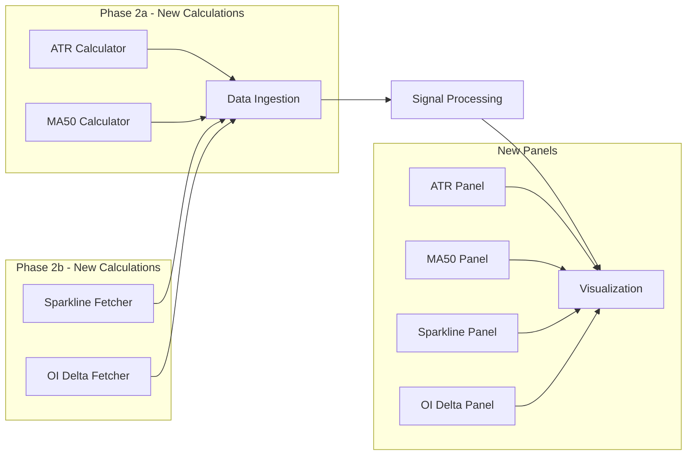
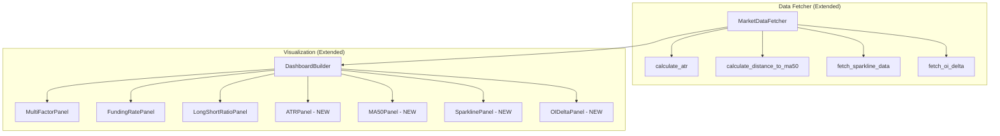

# Technical Design Document: Dashboard Enhancement Phase 2

## Overview

This document describes the technical design for Dashboard Enhancement Phase 2 of the Crypto Screener System. The enhancement adds four new contextual metrics to the existing 3-panel dashboard, creating a comprehensive 7-panel visualization for futures traders. The implementation follows the existing modular architecture and panel class pattern.

### Key Design Decisions

1. **Phased Implementation**: Phase 2a (ATR + MA50) delivers quick wins using existing OHLCV infrastructure; Phase 2b (Sparkline + OI Delta) adds new API endpoints
2. **Panel Class Pattern**: New panels follow the existing `render(ax, df)` interface pattern for consistency
3. **Data Fetcher Extension**: New calculation methods added to `MarketDataFetcher` class rather than creating new classes
4. **Graceful Degradation**: Each new metric fails independently without affecting other panels
5. **Shared Y-Axis**: All 7 panels maintain consistent asset ordering based on Multi-Factor Score

## Architecture

### System Architecture

The enhanced system extends the existing pipeline with new data calculation and visualization components:



### Component Architecture



### Technology Stack

- **Language**: Python 3.8+
- **Exchange Integration**: CCXT library (existing)
- **Data Processing**: pandas, numpy (existing)
- **Visualization**: matplotlib, seaborn (existing)
- **New API**: Binance Futures REST API for Open Interest data

## Components and Interfaces

### 1. Data Fetcher Extensions (Phase 2a)

**Responsibility**: Calculate ATR and Distance to MA50 using existing OHLCV data.

**New Methods in MarketDataFetcher**:

```python
def calculate_atr(self, symbol: str, period: int = 14) -> dict:
    """
    Calculate Average True Range for a symbol.
    
    ATR Calculation:
    1. Fetch 15+ daily OHLCV candles
    2. Calculate True Range for each period:
       TR = max(High - Low, |High - Prev Close|, |Low - Prev Close|)
    3. Calculate 14-period SMA of True Range values
    4. Express as percentage of current price
    
    Args:
        symbol: Trading pair symbol (e.g., 'BTC/USDT:USDT')
        period: ATR period (default: 14)
        
    Returns:
        dict: {
            'atr_value': float,      # Raw ATR value
            'atr_percent': float,    # ATR as % of current price
            'volatility_level': str  # 'low', 'medium', 'high'
        }
    """

def calculate_distance_to_ma50(self, symbol: str) -> dict:
    """
    Calculate distance from current price to 50-day SMA.
    
    MA50 Calculation:
    1. Fetch 50 daily OHLCV candles
    2. Calculate SMA of closing prices
    3. Get current price from ticker
    4. Calculate: ((current - MA50) / MA50) * 100
    
    Args:
        symbol: Trading pair symbol
        
    Returns:
        dict: {
            'ma50': float,           # 50-day SMA value
            'current_price': float,  # Current price
            'distance_percent': float,  # Distance as percentage
            'position': str          # 'above' or 'below'
        }
    """
```

### 2. Data Fetcher Extensions (Phase 2b)

**Responsibility**: Fetch sparkline data and Open Interest delta.

**New Methods in MarketDataFetcher**:

```python
def fetch_sparkline_data(self, symbol: str) -> dict:
    """
    Fetch hourly price data for sparkline visualization.
    
    Sparkline Data:
    1. Try fetching 24 hourly candles (1h timeframe)
    2. Fallback to 42 4-hour candles if hourly fails
    3. Extract closing prices as data points
    4. Determine trend direction (first vs last price)
    
    Args:
        symbol: Trading pair symbol
        
    Returns:
        dict: {
            'prices': list[float],   # Price data points
            'trend': str,            # 'uptrend' or 'downtrend'
            'timeframe': str,        # '1h' or '4h'
            'change_percent': float  # Overall change %
        }
    """

def fetch_oi_delta(self, symbol: str) -> dict:
    """
    Fetch Open Interest change over 24 hours.
    
    OI Delta Calculation:
    1. Fetch current OI from Binance Futures API
    2. Fetch OI from 24 hours ago
    3. Calculate: ((current - 24h_ago) / 24h_ago) * 100
    4. Determine interpretation based on OI + price direction
    
    Binance API Endpoint:
    - Current OI: GET /fapi/v1/openInterest
    - Historical OI: GET /futures/data/openInterestHist
    
    Args:
        symbol: Trading pair symbol
        
    Returns:
        dict: {
            'current_oi': float,     # Current Open Interest
            'oi_24h_ago': float,     # OI 24 hours ago
            'oi_delta_percent': float,  # Change percentage
            'interpretation': str    # 'strong_bullish', 'weak_bullish', etc.
        }
    """
```

### 3. New Visualization Panels

**Responsibility**: Render new metric panels following existing pattern.

**New Panel Classes**:

```python
class ATRPanel:
    """
    Renders ATR (Average True Range) visualization panel.
    
    Color Scheme:
    - Green (#4CAF50): ATR < 3% (low volatility)
    - Yellow (#FFC107): 3% <= ATR <= 6% (medium volatility)
    - Red (#F44336): ATR > 6% (high volatility)
    """
    
    def render(self, ax, df: pd.DataFrame):
        """
        Create horizontal bar chart for ATR values.
        
        Required DataFrame columns:
        - 'symbol': Asset symbol
        - 'atr_percent': ATR as percentage of price
        
        Visualization:
        - Y-axis: Asset symbols (ordered by multi-factor score)
        - X-axis: ATR percentage (0% to max)
        - Colors: Based on volatility thresholds
        - Labels: ATR % formatted to 2 decimal places
        """

class MA50Panel:
    """
    Renders Distance to MA50 visualization panel.
    
    Color Scheme:
    - Green (#4CAF50): Positive distance (price above MA50)
    - Red (#F44336): Negative distance (price below MA50)
    """
    
    def render(self, ax, df: pd.DataFrame):
        """
        Create horizontal bar chart for MA50 distance.
        
        Required DataFrame columns:
        - 'symbol': Asset symbol
        - 'distance_to_ma50': Distance as percentage
        
        Visualization:
        - Y-axis: Asset symbols (ordered by multi-factor score)
        - X-axis: Distance percentage (can be negative)
        - Reference line: 0% (price at MA50)
        - Colors: Green for positive, red for negative
        """

class SparklinePanel:
    """
    Renders Sparkline trend visualization panel.
    
    Color Scheme:
    - Green (#4CAF50): Uptrend (last > first)
    - Red (#F44336): Downtrend (last <= first)
    - Gray (#9E9E9E): Neutral (equal prices)
    """
    
    def render(self, ax, df: pd.DataFrame):
        """
        Create mini line charts for each asset.
        
        Required DataFrame columns:
        - 'symbol': Asset symbol
        - 'sparkline_data': List of price points
        - 'sparkline_trend': 'uptrend' or 'downtrend'
        
        Visualization:
        - Y-axis: Asset symbols (ordered by multi-factor score)
        - Each row: Mini line chart showing 24h price trend
        - Colors: Based on trend direction
        - Normalization: Min-max scaling per asset
        """

class OIDeltaPanel:
    """
    Renders Open Interest Delta visualization panel.
    
    Color Scheme:
    - Blue (#2196F3): Positive OI delta (new positions opening)
    - Orange (#FF9800): Negative OI delta (positions closing)
    - Gray (#9E9E9E): Zero change
    """
    
    def render(self, ax, df: pd.DataFrame):
        """
        Create horizontal bar chart for OI delta.
        
        Required DataFrame columns:
        - 'symbol': Asset symbol
        - 'oi_delta_percent': OI change percentage
        
        Visualization:
        - Y-axis: Asset symbols (ordered by multi-factor score)
        - X-axis: OI delta percentage (can be negative)
        - Reference line: 0% (no change)
        - Colors: Blue for positive, orange for negative
        """
```

### 4. Dashboard Builder Enhancement

**Responsibility**: Coordinate 7-panel dashboard creation.

**Modified DashboardBuilder**:

```python
class DashboardBuilder:
    """
    Enhanced dashboard builder supporting 7 panels.
    """
    
    def __init__(self, df: pd.DataFrame):
        """
        Initialize with DataFrame containing all metrics.
        
        Required columns (existing):
        - symbol, multi_factor_score, tier
        - funding_rate, long_short_ratio
        
        Required columns (new - Phase 2a):
        - atr_percent
        - distance_to_ma50
        
        Required columns (new - Phase 2b):
        - sparkline_data, sparkline_trend
        - oi_delta_percent
        """
    
    def create_dashboard(self) -> matplotlib.figure.Figure:
        """
        Create 7-panel figure with shared Y-axis.
        
        Panel Order (top to bottom):
        1. Multi-Factor Score (existing)
        2. Funding Rate (existing)
        3. Long/Short Ratio (existing)
        4. ATR (new - Phase 2a)
        5. Distance to MA50 (new - Phase 2a)
        6. Sparkline Trend (new - Phase 2b)
        7. OI Delta (new - Phase 2b)
        
        Figure Size: 12 x 18 inches (increased height for 7 panels)
        """
```

## Data Models

### Extended DataFrame Schema

The system extends the existing DataFrame with new columns:

| Column | Type | Description | Phase | Nullable |
|--------|------|-------------|-------|----------|
| symbol | str | Asset symbol | Existing | No |
| price | float | Current price | Existing | No |
| change_24h | float | 24h percentage change | Existing | No |
| funding_rate | float | Funding rate % | Existing | Yes |
| long_short_ratio | float | L/S ratio | Existing | Yes |
| multi_factor_score | float | Composite score | Existing | No |
| tier | str | 'A' or 'B' | Existing | No |
| rank | int | Ranking position | Existing | No |
| **atr_percent** | float | ATR as % of price | 2a | Yes |
| **distance_to_ma50** | float | Distance to MA50 % | 2a | Yes |
| **sparkline_data** | list | Price data points | 2b | Yes |
| **sparkline_trend** | str | 'uptrend'/'downtrend' | 2b | Yes |
| **oi_delta_percent** | float | OI change % | 2b | Yes |
| **oi_interpretation** | str | Market context | 2b | Yes |

### ATR Calculation Data Flow

```python
# Input: OHLCV data (15+ daily candles)
ohlcv = [
    [timestamp, open, high, low, close, volume],
    ...
]

# Step 1: Calculate True Range for each period
true_ranges = []
for i in range(1, len(ohlcv)):
    high = ohlcv[i][2]
    low = ohlcv[i][3]
    prev_close = ohlcv[i-1][4]
    
    tr = max(
        high - low,
        abs(high - prev_close),
        abs(low - prev_close)
    )
    true_ranges.append(tr)

# Step 2: Calculate 14-period SMA
atr = sum(true_ranges[-14:]) / 14

# Step 3: Express as percentage
current_price = ohlcv[-1][4]
atr_percent = (atr / current_price) * 100
```

### OI Delta Interpretation Matrix

| OI Delta | Price Change | Interpretation | Signal |
|----------|--------------|----------------|--------|
| Positive | Positive | strong_bullish | New money entering longs |
| Negative | Positive | weak_bullish | Short covering |
| Positive | Negative | strong_bearish | New money entering shorts |
| Negative | Negative | weak_bearish | Long liquidation |
| Zero | Any | neutral | No significant change |

## Correctness Properties

### Property 1: ATR Calculation Correctness

*For any* valid OHLCV dataset with at least 15 candles, the ATR calculation SHALL produce a non-negative value equal to the 14-period simple moving average of True Range values.

**Validates: Requirements 1.1, 1.3, 1.4**

### Property 2: ATR Percentage Normalization

*For any* ATR value and current price where price > 0, the ATR percentage SHALL equal (ATR / price) * 100.

**Validates: Requirements 1.6**

### Property 3: MA50 Distance Calculation

*For any* valid OHLCV dataset with at least 50 candles and current price, the Distance to MA50 SHALL equal ((current_price - MA50) / MA50) * 100.

**Validates: Requirements 3.3, 3.4, 3.5**

### Property 4: ATR Color Threshold Consistency

*For any* ATR percentage value, the visualization SHALL apply exactly one color based on thresholds: green if < 3%, yellow if 3-6%, red if > 6%.

**Validates: Requirements 2.3, 2.4, 2.5**

### Property 5: MA50 Color Sign Consistency

*For any* Distance to MA50 value, the visualization SHALL apply green color for positive values and red color for negative values.

**Validates: Requirements 4.3, 4.4**

### Property 6: Sparkline Trend Classification

*For any* sparkline data with at least 2 points, the trend SHALL be classified as 'uptrend' if last > first, otherwise 'downtrend'.

**Validates: Requirements 5.4, 5.5, 5.6**

### Property 7: OI Delta Interpretation Consistency

*For any* combination of OI delta and price change, the interpretation SHALL follow the defined matrix: positive OI + positive price = strong_bullish, etc.

**Validates: Requirements 7.4, 7.5, 7.6, 7.7**

### Property 8: Panel Order Consistency

*For any* dashboard with 7 panels, all panels SHALL display assets in the same order based on Multi-Factor Score ranking (highest to lowest).

**Validates: Requirements 9.4, 9.5**

### Property 9: Graceful Degradation

*For any* DataFrame with missing new metric columns, the dashboard SHALL render available panels and display "No data available" for missing panels.

**Validates: Requirements 12.1, 12.2, 12.3, 12.4, 12.5**

### Property 10: Insufficient Data Handling

*For any* symbol with fewer than 15 OHLCV candles, ATR SHALL be null. *For any* symbol with fewer than 50 candles, MA50 distance SHALL be null.

**Validates: Requirements 1.7, 3.3**

## Error Handling

### Error Categories and Strategies

#### 1. Insufficient OHLCV Data

**Scenario**: Symbol has fewer candles than required for calculation

**Handling Strategy**:
- ATR: Requires 15+ candles, return null if fewer
- MA50: Requires 50+ candles, return null if fewer
- Log warning with symbol name and available candle count
- Continue processing other symbols

```python
def calculate_atr(self, symbol: str, period: int = 14) -> dict:
    ohlcv = self.fetch_ohlcv(symbol, '1d', limit=period + 1)
    
    if len(ohlcv) < period + 1:
        logger.warning(f"Insufficient data for ATR: {symbol} has {len(ohlcv)} candles, need {period + 1}")
        return {'atr_percent': None, 'volatility_level': None}
```

#### 2. Open Interest API Failure

**Scenario**: Binance OI endpoint returns error or timeout

**Handling Strategy**:
- Catch requests exceptions (timeout, connection error)
- Log error with symbol and error details
- Set OI delta to null for that symbol
- Continue processing other symbols

```python
def fetch_oi_delta(self, symbol: str) -> dict:
    try:
        current_oi = self._fetch_current_oi(symbol)
        historical_oi = self._fetch_historical_oi(symbol)
    except requests.RequestException as e:
        logger.error(f"OI API error for {symbol}: {e}")
        return {'oi_delta_percent': None, 'interpretation': None}
```

#### 3. Sparkline Fallback

**Scenario**: Hourly OHLCV data unavailable

**Handling Strategy**:
- First attempt: Fetch 24 hourly candles
- Fallback: Fetch 42 4-hour candles (7 days)
- If both fail: Set sparkline data to null
- Log which timeframe was used

```python
def fetch_sparkline_data(self, symbol: str) -> dict:
    try:
        ohlcv = self.fetch_ohlcv(symbol, '1h', limit=24)
        timeframe = '1h'
    except Exception:
        logger.warning(f"Hourly data unavailable for {symbol}, trying 4h")
        try:
            ohlcv = self.fetch_ohlcv(symbol, '4h', limit=42)
            timeframe = '4h'
        except Exception as e:
            logger.error(f"Sparkline data unavailable for {symbol}: {e}")
            return {'prices': None, 'trend': None}
```

#### 4. Panel Rendering Failure

**Scenario**: Individual panel fails to render

**Handling Strategy**:
- Catch exceptions per-panel in DashboardBuilder
- Display "Data unavailable" message in failed panel
- Continue rendering other panels
- Log error with panel name and details

```python
def create_dashboard(self):
    # ... existing panels ...
    
    # Render ATR Panel with error handling
    try:
        if 'atr_percent' in self.df.columns:
            atr_panel = ATRPanel()
            atr_panel.render(axes[3], self.df)
        else:
            axes[3].text(0.5, 0.5, 'ATR data not available',
                        ha='center', va='center', transform=axes[3].transAxes)
    except Exception as e:
        logger.error(f"ATR panel rendering failed: {e}")
        axes[3].text(0.5, 0.5, 'ATR panel error',
                    ha='center', va='center', transform=axes[3].transAxes)
```

## Testing Strategy

### Property-Based Testing

**Library**: `hypothesis` for Python

**Property Tests**:

1. **ATR Calculation** (Property 1, 2)
   - Generate random OHLCV data with varying lengths
   - Verify ATR equals 14-period SMA of True Range
   - Verify ATR percentage calculation

2. **MA50 Distance** (Property 3)
   - Generate random price series
   - Verify distance formula correctness
   - Verify sign matches price position

3. **Color Thresholds** (Property 4, 5)
   - Generate random ATR/MA50 values
   - Verify correct color assignment
   - Verify threshold boundaries

4. **Trend Classification** (Property 6)
   - Generate random price sequences
   - Verify trend matches first/last comparison

5. **OI Interpretation** (Property 7)
   - Generate all combinations of OI delta and price change
   - Verify interpretation matrix correctness

### Unit Testing

**Test Categories**:

1. **ATR Calculation Tests**
   - Test with exactly 15 candles
   - Test with insufficient data (< 15)
   - Test True Range calculation edge cases
   - Test percentage conversion

2. **MA50 Calculation Tests**
   - Test with exactly 50 candles
   - Test with insufficient data (< 50)
   - Test positive/negative distance
   - Test price at MA50 (zero distance)

3. **Sparkline Tests**
   - Test hourly data fetch
   - Test 4-hour fallback
   - Test trend classification
   - Test normalization

4. **OI Delta Tests**
   - Test API response parsing
   - Test delta calculation
   - Test interpretation matrix
   - Test zero OI handling

5. **Panel Rendering Tests**
   - Test each panel with valid data
   - Test with missing columns
   - Test with empty DataFrame
   - Test color assignments

### Integration Testing

1. **Full Pipeline Test (Phase 2a)**
   - Fetch real OHLCV data
   - Calculate ATR and MA50
   - Render 5-panel dashboard
   - Verify output file

2. **Full Pipeline Test (Phase 2b)**
   - Fetch sparkline and OI data
   - Render 7-panel dashboard
   - Verify all panels present

3. **Graceful Degradation Test**
   - Simulate API failures
   - Verify partial dashboard renders
   - Verify error messages displayed

## Implementation Plan

### Phase 2a Tasks (Low Effort, High Impact)

1. Add `calculate_atr()` method to MarketDataFetcher
2. Add `calculate_distance_to_ma50()` method to MarketDataFetcher
3. Create `ATRPanel` class in panels.py
4. Create `MA50Panel` class in panels.py
5. Update `DashboardBuilder` to support 5 panels
6. Update `fetch_all_data()` to include new metrics
7. Add unit tests for new calculations
8. Add property tests for correctness

### Phase 2b Tasks (Medium Effort, Transformative Value)

1. Add `fetch_sparkline_data()` method to MarketDataFetcher
2. Add `fetch_oi_delta()` method to MarketDataFetcher
3. Add Binance OI API integration
4. Create `SparklinePanel` class in panels.py
5. Create `OIDeltaPanel` class in panels.py
6. Update `DashboardBuilder` to support 7 panels
7. Update `fetch_all_data()` to include Phase 2b metrics
8. Add unit tests for new features
9. Add integration tests for full pipeline
