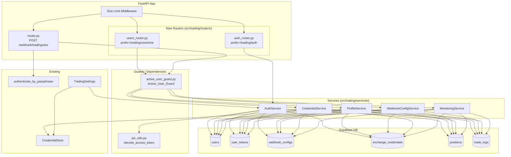

# Design Document: Trading User Management API

## Overview

This design extends the existing `src/trading/` FastAPI module with a full user lifecycle API: registration, JWT-based authentication, profile management, webhook passphrase configuration, exchange credential management, and trading monitoring. The existing `POST /webhook/tradingview` pipeline remains intact; the only change to it is the insertion of an `Active_User_Guard` dependency that confirms `users.is_active = true` for the user resolved by passphrase.

### Key Design Decisions

- **Stateless access tokens**: JWTs signed with `TRADING_JWT_SECRET` (HS256), 30-minute expiry, never stored server-side. Verification is signature + exp only, plus one DB `is_active` check per request.
- **Hashed refresh tokens**: Random 32-byte hex strings stored as SHA-256 hashes in `user_tokens`. Plaintext is returned once at login and never stored.
- **Fernet credential encryption**: The existing `CredentialStore` is reused as-is for all credential storage in the new API endpoints.
- **bcrypt password hashing**: `passlib[bcrypt]` is used for password hashing and verification.
- **JWT library**: `python-jose[cryptography]` for JWT encode/decode (already common in FastAPI ecosystems).
- **Router layout**: New routers are kept in `src/trading/routers/` sub-package to avoid polluting the top-level trading package.
- **Service layer**: Business logic is in service classes (`AuthService`, `ProfileService`, `WebhookConfigService`, `CredentialService`, `MonitoringService`), keeping routers thin.


## Architecture

### Component Diagram



### New File Layout

```
src/trading/
├── routers/
│   ├── __init__.py
│   ├── auth_router.py          # POST /trading/auth/{register,login,refresh,logout}
│   └── users_router.py         # GET/PATCH /trading/users/me and all sub-resources
├── services/
│   ├── __init__.py
│   ├── auth_service.py         # AuthService
│   ├── profile_service.py      # ProfileService
│   ├── webhook_config_service.py  # WebhookConfigService
│   ├── credential_service.py   # CredentialService
│   └── monitoring_service.py   # MonitoringService
├── active_user_guard.py        # Active_User_Guard FastAPI dependency
├── jwt_utils.py                # JWT encode/decode helpers
├── password_utils.py           # bcrypt hash/verify helpers
├── user_models.py              # New Pydantic request/response models
├── config.py                   # Extended TradingSettings (JWT fields added)
├── auth.py                     # Unchanged (passphrase auth)
├── credentials.py              # Unchanged (CredentialStore)
├── router.py                   # Updated: adds Active_User_Guard dependency
└── models.py                   # Unchanged (WebhookPayload etc.)
```


## Components and Interfaces

### `jwt_utils.py`

```python
from datetime import datetime, timedelta, timezone
from jose import JWTError, jwt

def create_access_token(user_id: str, secret: str, expire_minutes: int) -> str:
    """Return a signed HS256 JWT with sub, exp, iat claims."""
    now = datetime.now(timezone.utc)
    payload = {"sub": user_id, "iat": now, "exp": now + timedelta(minutes=expire_minutes)}
    return jwt.encode(payload, secret, algorithm="HS256")

def decode_access_token(token: str, secret: str) -> dict:
    """Decode and verify JWT. Raises JWTError on invalid signature or expiry."""
    return jwt.decode(token, secret, algorithms=["HS256"])
```

### `password_utils.py`

```python
from passlib.context import CryptContext

_ctx = CryptContext(schemes=["bcrypt"], deprecated="auto")

def hash_password(plain: str) -> str:
    return _ctx.hash(plain)

def verify_password(plain: str, hashed: str) -> bool:
    return _ctx.verify(plain, hashed)
```

### `active_user_guard.py`

```python
from typing import Annotated, Any
from fastapi import Depends, HTTPException, Security
from fastapi.security import HTTPAuthorizationCredentials, HTTPBearer
from jose import JWTError

bearer_scheme = HTTPBearer()

async def active_user_guard(
    credentials: Annotated[HTTPAuthorizationCredentials, Security(bearer_scheme)],
    settings: Annotated[TradingSettings, Depends(get_settings)],
    supabase: Annotated[Any, Depends(get_supabase_client)],
) -> dict:
    """
    FastAPI dependency applied to all protected endpoints.
    1. Extracts Bearer token from Authorization header (401 if missing).
    2. Verifies JWT signature and exp with python-jose (401 on failure).
    3. Queries users table once: SELECT is_active WHERE id = sub (401 if false).
    Returns the decoded JWT payload dict.
    """
    token = credentials.credentials
    try:
        payload = decode_access_token(token, settings.jwt_secret)
    except JWTError:
        raise HTTPException(status_code=401, detail="Invalid or expired token")

    user_id = payload.get("sub")
    if not user_id:
        raise HTTPException(status_code=401, detail="Invalid token claims")

    response = supabase.table("users").select("is_active").eq("id", user_id).single().execute()
    if not response.data or not response.data.get("is_active"):
        raise HTTPException(status_code=401, detail="User account is inactive")

    return payload
```

### `active_user_guard.py` — Webhook Integration

The existing `router.py` webhook endpoint gains an `Active_User_Guard`-equivalent check **after** passphrase authentication resolves the user. Rather than adding the JWT Bearer dependency (the webhook uses passphrase auth, not JWT), the guard is applied inline in `authenticate_by_passphrase` or as a post-auth step:

```python
# In router.py receive_tradingview_alert, after auth_result is obtained:
user_record = supabase.table("users").select("is_active").eq("id", user_id).single().execute()
if not user_record.data or not user_record.data.get("is_active"):
    raise HTTPException(status_code=401, detail="Unauthorized")
```

This keeps the JWT guard for JWT-authenticated routes and the passphrase-resolved active check for the webhook, satisfying Requirement 5.7.


### Service Interfaces

#### `AuthService`

```python
class AuthService:
    def __init__(self, supabase, settings: TradingSettings): ...

    async def register(self, email: str, name: str, password: str,
                       telegram_chat_id: str | None = None) -> UserProfileResponse:
        """Hash password, insert user, return profile. Raises 409 on duplicate email."""

    async def login(self, email: str, password: str) -> TokenResponse:
        """Verify password, issue JWT + refresh token, persist token hash."""

    async def refresh(self, refresh_token: str) -> AccessTokenResponse:
        """Validate refresh token hash, return new access JWT."""

    async def logout(self, user_id: str) -> None:
        """Delete all user_tokens records for user_id."""
```

#### `ProfileService`

```python
class ProfileService:
    def __init__(self, supabase, settings: TradingSettings): ...

    async def get_profile(self, user_id: str) -> UserProfileResponse: ...

    async def update_profile(self, user_id: str, update: ProfileUpdateRequest) -> UserProfileResponse:
        """Update only the fields present in update. Hash new password if provided."""
```

#### `WebhookConfigService`

```python
class WebhookConfigService:
    def __init__(self, supabase): ...

    async def get_active(self, user_id: str) -> WebhookConfigResponse: ...       # 404 if none
    async def create(self, user_id: str, passphrase: str) -> WebhookConfigResponse:  # 409 if duplicate
    async def update(self, user_id: str, passphrase: str) -> WebhookConfigResponse:  # 404/409
    async def deactivate(self, user_id: str) -> WebhookConfigResponse:            # 404 if none
```

#### `CredentialService`

```python
class CredentialService:
    def __init__(self, supabase, credential_store: CredentialStore): ...

    async def list_credentials(self, user_id: str) -> list[CredentialSummaryResponse]: ...
    async def upsert_credentials(self, user_id: str, req: CredentialUpsertRequest) -> CredentialSummaryResponse: ...
    async def delete_credentials(self, user_id: str, exchange: str) -> dict: ...  # 404 if missing
```

#### `MonitoringService`

```python
class MonitoringService:
    def __init__(self, supabase): ...

    async def get_open_positions(self, user_id: str) -> list[OpenPositionResponse]: ...
    async def get_position_history(self, user_id: str) -> list[ClosedPositionResponse]: ...
    async def get_trade_log(self, user_id: str) -> list[TradeLogResponse]: ...
```


## Data Models

### Config Extension (`config.py`)

Three fields are added to `TradingSettings`:

```python
# JWT signing secret — required; raises ValueError at startup if empty
jwt_secret: str = ""

# Access token expiry in minutes (default 30)
access_token_expire_minutes: int = 30

# Refresh token expiry in days (default 7)
refresh_token_expire_days: int = 7
```

`get_trading_settings()` should validate that `jwt_secret` is non-empty and raise `ValueError` if not (Requirement 19.1).

### Pydantic Request/Response Models (`user_models.py`)

#### Registration

```python
class RegisterRequest(BaseModel):
    email: EmailStr
    name: str = Field(min_length=1)
    password: str = Field(min_length=8)
    telegram_chat_id: str | None = None

class UserProfileResponse(BaseModel):
    id: str
    email: str
    name: str
    telegram_chat_id: str | None
    is_active: bool
    created_at: datetime
```

#### Authentication

```python
class LoginRequest(BaseModel):
    email: EmailStr
    password: str

class TokenResponse(BaseModel):
    access_token: str
    refresh_token: str
    token_type: Literal["bearer"] = "bearer"
    expires_in: int = 1800

class AccessTokenResponse(BaseModel):
    access_token: str
    token_type: Literal["bearer"] = "bearer"
    expires_in: int = 1800

class RefreshRequest(BaseModel):
    refresh_token: str
```

#### Profile Update

```python
class ProfileUpdateRequest(BaseModel):
    name: str | None = Field(default=None, min_length=1)
    telegram_chat_id: str | None = None
    password: str | None = Field(default=None, min_length=8)

    @model_validator(mode="after")
    def at_least_one_field(self) -> "ProfileUpdateRequest":
        if self.name is None and self.telegram_chat_id is None and self.password is None:
            raise ValueError("At least one updatable field must be provided")
        return self
```

#### Webhook Config

```python
class WebhookConfigCreateRequest(BaseModel):
    passphrase: str = Field(min_length=8)

class WebhookConfigUpdateRequest(BaseModel):
    passphrase: str = Field(min_length=8)

class WebhookConfigResponse(BaseModel):
    id: str
    passphrase: str  # returned in full (plaintext stored in DB)
    is_active: bool
    created_at: datetime
```

#### Credentials

```python
class CredentialUpsertRequest(BaseModel):
    exchange: Literal["binance", "okx"]
    api_key: str = Field(min_length=1)
    secret: str = Field(min_length=1)
    api_passphrase: str | None = None

class CredentialSummaryResponse(BaseModel):
    exchange: str
    is_configured: bool = True
    created_at: datetime
```

#### Monitoring

```python
class OpenPositionResponse(BaseModel):
    id: str
    symbol: str
    side: str
    entry_price: float
    quantity: float
    opened_at: datetime
    exchange: str

class ClosedPositionResponse(BaseModel):
    id: str
    symbol: str
    side: str
    entry_price: float
    exit_price: float
    quantity: float
    opened_at: datetime
    closed_at: datetime
    exchange: str

class TradeLogResponse(BaseModel):
    id: str
    symbol: str
    action: str
    side: str
    exchange: str
    size_value: float
    status: str
    order_id: str | None
    fill_price: float | None
    filled_quantity: float | None
    error_details: str | None
    created_at: datetime
```


### Database Schema

#### `users` Table Extension

```sql
-- Extend existing users table (assumed to have id UUID PK, email TEXT, created_at)
ALTER TABLE users
  ADD COLUMN IF NOT EXISTS name             TEXT         NOT NULL DEFAULT '',
  ADD COLUMN IF NOT EXISTS password_hash    TEXT         NOT NULL DEFAULT '',
  ADD COLUMN IF NOT EXISTS telegram_chat_id TEXT,
  ADD COLUMN IF NOT EXISTS is_active        BOOLEAN      NOT NULL DEFAULT TRUE,
  ADD COLUMN IF NOT EXISTS deleted_at       TIMESTAMPTZ;

-- Unique constraint on email (may already exist)
ALTER TABLE users
  ADD CONSTRAINT users_email_unique UNIQUE (email);
```

#### `user_tokens` Table (New)

```sql
CREATE TABLE IF NOT EXISTS user_tokens (
    id          UUID        PRIMARY KEY DEFAULT gen_random_uuid(),
    user_id     UUID        NOT NULL REFERENCES users(id) ON DELETE CASCADE,
    token_hash  TEXT        NOT NULL UNIQUE,
    expires_at  TIMESTAMPTZ NOT NULL,
    created_at  TIMESTAMPTZ NOT NULL DEFAULT NOW()
);

CREATE INDEX IF NOT EXISTS idx_user_tokens_user_id ON user_tokens(user_id);
```

#### Refresh Token Storage Strategy

- At login: generate `secrets.token_hex(32)` (64-char hex string), return the plaintext to the client, store `hashlib.sha256(plaintext.encode()).hexdigest()` in `token_hash`.
- At refresh: hash the incoming token with SHA-256, look up by `token_hash`.
- Logout: `DELETE FROM user_tokens WHERE user_id = ?` — removes all sessions.

SHA-256 is used (rather than bcrypt) for refresh tokens because: (a) the token is already 256 bits of entropy so rainbow tables are infeasible, (b) fast lookup is needed on every refresh, (c) bcrypt's cost factor is unnecessary at this entropy level.


## API Route Structure

### `routers/auth_router.py`

```
APIRouter(prefix="/trading/auth", tags=["Auth"])

POST /trading/auth/register    → 201 UserProfileResponse
POST /trading/auth/login       → 200 TokenResponse
POST /trading/auth/refresh     → 200 AccessTokenResponse
POST /trading/auth/logout      → 200 {"message": "Logged out"}  [requires Active_User_Guard]
```

### `routers/users_router.py`

```
APIRouter(prefix="/trading/users/me", tags=["Users"])
All routes depend on Active_User_Guard

GET    /trading/users/me                           → 200 UserProfileResponse
PATCH  /trading/users/me                           → 200 UserProfileResponse

GET    /trading/users/me/webhook-config            → 200 WebhookConfigResponse
POST   /trading/users/me/webhook-config            → 201 WebhookConfigResponse
PATCH  /trading/users/me/webhook-config            → 200 WebhookConfigResponse
DELETE /trading/users/me/webhook-config            → 200 WebhookConfigResponse

GET    /trading/users/me/credentials               → 200 list[CredentialSummaryResponse]
POST   /trading/users/me/credentials               → 200 CredentialSummaryResponse
DELETE /trading/users/me/credentials/{exchange}    → 200 {"message": "Credentials removed"}

GET    /trading/users/me/positions                 → 200 list[OpenPositionResponse]
GET    /trading/users/me/positions/history         → 200 list[ClosedPositionResponse]
GET    /trading/users/me/trades                    → 200 list[TradeLogResponse]
```

### Router Registration

In the application factory (e.g., `main.py` or the trading module's `__init__.py`):

```python
from trading.routers.auth_router import router as auth_router
from trading.routers.users_router import router as users_router
from trading.router import router as webhook_router

app.include_router(auth_router)
app.include_router(users_router)
app.include_router(webhook_router)  # existing, updated with is_active check
```

A `ContentSizeLimitMiddleware` (or use `app.add_middleware`) enforces the 1 MB limit globally, satisfying Requirement 20.3. This is equivalent to the existing per-request body check in `router.py`, but applied at the middleware layer for new routes.


## Correctness Properties

*A property is a characteristic or behavior that should hold true across all valid executions of a system — essentially, a formal statement about what the system should do. Properties serve as the bridge between human-readable specifications and machine-verifiable correctness guarantees.*

### Prework Reflection

Before writing the final properties, I reviewed the prework analysis for redundancy:

- Requirements 1.2 (invalid email → 422) and 1.5 (short password → 422) both test input validation ranges; they target different fields so both are kept but expressed as one combined "registration input validation" property.
- Requirements 2.6 (JWT claims) and 3.1 (refresh produces valid JWT) both assert properties about JWT tokens. They are combined into one "JWT access token claims invariant" property.
- Requirements 12.2 and 13.4 (no secrets in credential responses) are identical in intent and merged.
- Requirements 16.3 and 17.3 (descending ordering) are the same invariant applied to two collections; they are expressed as one "monitoring list ordering" property.
- Requirements 7.1 and 7.2 (profile update partial and password hashing) can be tested together in a single patch-roundtrip property.
- Requirements 1.6 and 7.2 both test bcrypt storage; they are merged into one "password storage" property.

After reflection, eight non-redundant properties remain.

---

### Property 1: Registration input validation rejects out-of-range values

*For any* registration request where either the `email` field is not a valid email format OR the `password` field has fewer than 8 characters OR the `name` field is empty, the Auth_Service SHALL return a 422 status whose error body names the failing field.

**Validates: Requirements 1.2, 1.4, 1.5**

---

### Property 2: Password is always stored as a bcrypt hash, never plaintext

*For any* plaintext password used during user registration or profile update, the value persisted in `users.password_hash` SHALL satisfy `bcrypt.checkpw(plaintext, stored_hash) == True` and SHALL NOT equal the plaintext string.

**Validates: Requirements 1.6, 7.2**

---

### Property 3: JWT access token claims invariant

*For any* access token issued by the Auth_Service (on login or token refresh), decoding the token with `TRADING_JWT_SECRET` and the HS256 algorithm SHALL yield a payload where `sub` equals the user's UUID, `exp` is strictly greater than the issuance time by the configured `TRADING_ACCESS_TOKEN_EXPIRE_MINUTES`, and `iat` is present.

**Validates: Requirements 2.6, 3.1**

---

### Property 4: Logout removes all refresh tokens for the user

*For any* authenticated user who has one or more records in `user_tokens`, calling `POST /trading/auth/logout` with a valid access token SHALL result in zero records remaining in `user_tokens` for that `user_id`.

**Validates: Requirements 4.1**

---

### Property 5: Profile update partial-write invariant

*For any* authenticated user, a PATCH to `/trading/users/me` containing a non-empty subset of `{name, telegram_chat_id, password}` SHALL update exactly the provided fields and leave all other profile fields unchanged. The response SHALL include all profile fields and NOT include `password_hash`.

**Validates: Requirements 6.2, 7.1**

---

### Property 6: Credential responses never expose secrets

*For any* authenticated user and any number of configured credentials, the JSON body of both `GET /trading/users/me/credentials` and `POST /trading/users/me/credentials` SHALL NOT contain any of the keys `api_key`, `secret`, or `api_passphrase`.

**Validates: Requirements 12.2, 13.4**

---

### Property 7: Exchange field validation rejects non-supported values

*For any* string supplied as the `exchange` field that is not `"binance"` or `"okx"`, both `POST /trading/users/me/credentials` and `DELETE /trading/users/me/credentials/{exchange}` SHALL return a 422 status.

**Validates: Requirements 13.2, 14.2**

---

### Property 8: Monitoring lists are ordered by timestamp descending

*For any* authenticated user with two or more closed positions (or trade log entries), the `GET /trading/users/me/positions/history` and `GET /trading/users/me/trades` responses SHALL return records in descending order by `closed_at` and `created_at` respectively (i.e., `response[i].timestamp >= response[i+1].timestamp` for all consecutive pairs).

**Validates: Requirements 16.3, 17.3**

---

### Property 9: Response model serialization round-trip

*For any* valid instance of `UserProfileResponse`, `TokenResponse`, `AccessTokenResponse`, `WebhookConfigResponse`, `CredentialSummaryResponse`, `OpenPositionResponse`, `ClosedPositionResponse`, or `TradeLogResponse`, calling `model.model_dump()` then `ModelClass.model_validate(json.loads(json.dumps(model.model_dump())))` SHALL produce an object with field values identical to the original.

**Validates: Requirements 20.2**


## Error Handling

### HTTP Status Code Mapping

| Condition | Status |
|---|---|
| Pydantic validation failure (bad field) | 422 |
| Missing / invalid JWT signature | 401 |
| Expired JWT | 401 |
| User `is_active = false` | 401 |
| Wrong email or password (login) | 401 |
| Duplicate email on register | 409 |
| Duplicate passphrase | 409 |
| User already has active webhook config | 409 |
| Resource not found (webhook config, position, credential) | 404 |
| Request body > 1 MB | 413 |
| DB or service unavailable | 503 |
| Unexpected internal error | 500 |

### Error Response Shape

All error responses use a consistent envelope:

```python
class APIErrorResponse(BaseModel):
    status: Literal["error"] = "error"
    error: str        # human-readable category, e.g. "Validation error"
    detail: str | None = None  # optional field-level detail
```

422 responses additionally include FastAPI's native `detail` list (field + message pairs) as the `detail` string.

### Guard Error Handling

`Active_User_Guard` always returns `{"status": "error", "error": "Unauthorized"}` with status 401, never disclosing whether the token was invalid, expired, or the account was inactive. This prevents account enumeration.

### Auth Service Error Handling

- Login failures (bad email, bad password, inactive user) all return identical 401 responses: `{"error": "Invalid credentials"}`. No distinction is made between email-not-found and wrong-password (Requirement 2.3).
- Refresh failures return `{"error": "Invalid or expired refresh token"}` (Requirement 3.2, 3.3).

### Database Errors

All service methods wrap Supabase calls in `try/except Exception`. Unexpected DB errors are logged at ERROR level and re-raised as `HTTPException(503, "Service unavailable")`.


## Testing Strategy

### Dual Testing Approach

Unit tests cover specific examples, edge cases, and error conditions. Property-based tests cover universal invariants across many generated inputs. Both are needed.

### Property-Based Testing Library

Use **Hypothesis** (Python) with `@given` and `@settings(max_examples=100)`. It integrates well with pytest and supports composite strategies for generating structured test data.

Tag format for each property test:
```python
# Feature: trading-user-management-api, Property N: <property_text>
```

### Property Tests (Hypothesis)

**Property 1 — Registration input validation**
```python
# Feature: trading-user-management-api, Property 1: Registration input validation rejects out-of-range values
@given(st.one_of(
    st.fixed_dictionaries({"email": st.text().filter(lambda s: "@" not in s), "name": st.text(min_size=1), "password": st.text(min_size=8)}),
    st.fixed_dictionaries({"email": st.emails(), "name": st.just(""), "password": st.text(min_size=8)}),
    st.fixed_dictionaries({"email": st.emails(), "name": st.text(min_size=1), "password": st.text(max_size=7)}),
))
@settings(max_examples=100)
def test_register_invalid_input_returns_422(invalid_payload): ...
```

**Property 2 — Password bcrypt storage**
```python
# Feature: trading-user-management-api, Property 2: Password always stored as bcrypt hash
@given(st.text(min_size=8, max_size=72))
@settings(max_examples=100)
def test_password_stored_as_bcrypt(plaintext): ...
```

**Property 3 — JWT claims invariant**
```python
# Feature: trading-user-management-api, Property 3: JWT access token claims invariant
@given(st.uuids().map(str))
@settings(max_examples=100)
def test_issued_jwt_has_correct_claims(user_id): ...
```

**Property 4 — Logout removes all tokens**
```python
# Feature: trading-user-management-api, Property 4: Logout removes all refresh tokens
@given(st.integers(min_value=1, max_value=5))
@settings(max_examples=100)
def test_logout_removes_all_tokens(num_tokens): ...
```

**Property 5 — Profile partial-write invariant**
```python
# Feature: trading-user-management-api, Property 5: Profile update partial-write invariant
@given(st.fixed_dictionaries({
    "name": st.one_of(st.none(), st.text(min_size=1)),
    "telegram_chat_id": st.one_of(st.none(), st.text()),
}).filter(lambda d: any(v is not None for v in d.values())))
@settings(max_examples=100)
def test_profile_patch_only_updates_provided_fields(update_payload): ...
```

**Property 6 — Credential responses never expose secrets**
```python
# Feature: trading-user-management-api, Property 6: Credential responses never expose secrets
@given(st.fixed_dictionaries({
    "exchange": st.sampled_from(["binance", "okx"]),
    "api_key": st.text(min_size=1),
    "secret": st.text(min_size=1),
}))
@settings(max_examples=100)
def test_credential_response_has_no_secrets(cred): ...
```

**Property 7 — Invalid exchange rejected**
```python
# Feature: trading-user-management-api, Property 7: Exchange field validation rejects non-supported values
@given(st.text().filter(lambda s: s not in ("binance", "okx")))
@settings(max_examples=100)
def test_invalid_exchange_returns_422(exchange): ...
```

**Property 8 — Monitoring lists ordered descending**
```python
# Feature: trading-user-management-api, Property 8: Monitoring lists ordered by timestamp descending
@given(st.lists(st.datetimes(timezones=st.just(timezone.utc)), min_size=2, max_size=10))
@settings(max_examples=100)
def test_trade_log_ordered_descending(timestamps): ...
```

**Property 9 — Response model serialization round-trip**
```python
# Feature: trading-user-management-api, Property 9: Response model serialization round-trip
@given(st.builds(UserProfileResponse, ...) | st.builds(TokenResponse, ...) | ...)
@settings(max_examples=100)
def test_response_model_json_roundtrip(response_model): ...
```

### Unit Tests (pytest)

Cover the following specific scenarios:

- Registration returns 201 with correct fields for a valid payload (Req 1.1)
- Duplicate email registration returns 409 (Req 1.3)
- Login returns 200 with correct response shape (Req 2.1)
- Login with wrong password returns 401 (Req 2.4)
- Login with inactive user returns 401 (Req 2.5)
- Refresh token lookup deletes expired record (Req 3.3)
- GET /users/me returns all required fields without password_hash (Req 6.1, 6.2)
- Webhook config 404 when none exists (Req 8.2)
- Webhook config 409 on duplicate creation (Req 9.3)
- Credential list returns empty array when none configured (Req 12.3)
- DELETE credential returns 404 when none exists (Req 14.3)
- Open positions returns empty array (Req 15.2)
- `Active_User_Guard` returns 401 for missing header (Req 5.2)
- `Active_User_Guard` returns 401 for tampered JWT (Req 5.3)
- `Active_User_Guard` returns 401 for expired JWT (Req 5.4)
- Webhook endpoint returns 401 when user is_active=false (Req 5.7)
- `TRADING_JWT_SECRET` absent raises ValueError at startup (Req 19.1)

### Integration Tests

- POST /webhook/tradingview with a passphrase belonging to an inactive user returns 401 (Req 5.7)
- Full login → access protected endpoint → logout → confirm tokens gone flow
- Schema migration: verify users table has all new columns and user_tokens table exists with index
