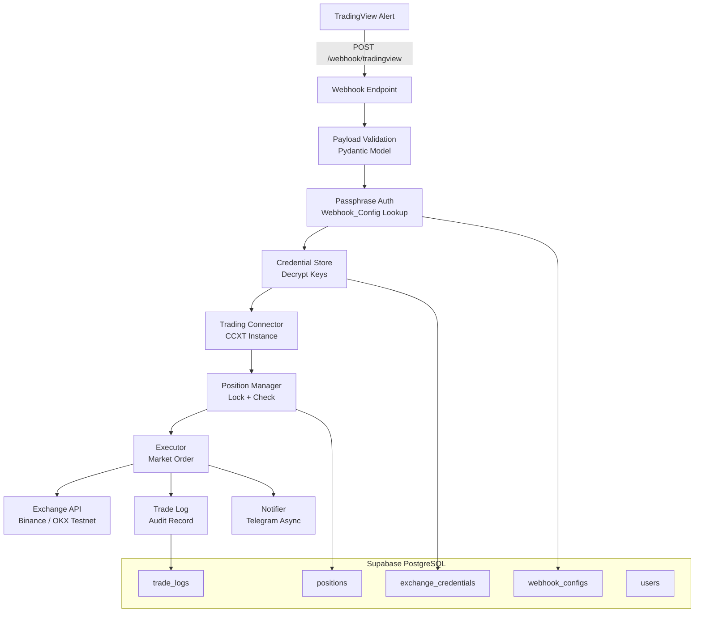

# Design Document: TradingView Webhook Trading

## Overview

This design describes a webhook-driven automated trading system that receives TradingView strategy alerts and executes cryptocurrency trades on Binance and OKX exchanges via the CCXT library. The system is architecturally separate from the existing screener module, sharing only the FastAPI application instance for routing.

The trading module introduces:
- A new `/webhook/tradingview` POST endpoint for receiving alerts
- A Pydantic-validated payload model with strict field constraints
- Passphrase-based multi-user authentication via Supabase
- Encrypted credential storage with Fernet symmetric encryption
- A dedicated trading connector (testnet-first, separate from the read-only screener connector)
- Market order execution with percent-of-balance and fixed-quantity sizing
- Position tracking with one-position-per-symbol-per-user enforcement via database-level locking
- Async Telegram notifications (non-blocking)
- Complete trade audit logging

## Architecture



### Module Separation

The trading module lives under `src/trading/` and does NOT inherit from or share instances with the existing `src/exchange/connector.py` (the read-only screener connector). The only integration point is the FastAPI app in `src/api/app.py`, which includes the trading router.

```
src/
├── api/
│   └── app.py              # Includes trading router
├── exchange/
│   └── connector.py        # Existing read-only screener (UNCHANGED)
└── trading/                # NEW - all trading module code
    ├── __init__.py
    ├── router.py           # FastAPI router for /webhook/tradingview
    ├── models.py           # Pydantic payload model + DB models
    ├── auth.py             # Passphrase lookup
    ├── credentials.py      # Encrypted credential store
    ├── connector.py        # Trading-specific CCXT connector (testnet)
    ├── executor.py         # Order execution logic
    ├── position_manager.py # Position tracking + locking
    ├── notifier.py         # Telegram notifications
    └── trade_logger.py     # Audit trail logging
```

## Components and Interfaces

### 1. Webhook Router (`src/trading/router.py`)

**Responsibility:** Receives HTTP POST requests, enforces payload size limits, delegates to the processing pipeline.

```python
from fastapi import APIRouter, Request, HTTPException
from .models import WebhookPayload

router = APIRouter(prefix="/webhook", tags=["Trading Webhook"])

@router.post("/tradingview", status_code=200)
async def receive_tradingview_alert(request: Request) -> dict:
    """
    Receive and process a TradingView strategy alert.
    
    Flow: validate payload → authenticate → execute trade → log → notify
    """
    ...
```

**Interface:**
- Input: Raw HTTP POST request (JSON body, max 1 MB)
- Output: `{"status": "success", "order_id": "..."}` or error response
- Error codes: 400 (malformed), 413 (too large), 422 (validation), 401 (auth), 503 (unavailable)

### 2. Payload Model (`src/trading/models.py`)

**Responsibility:** Pydantic model for strict payload validation with custom validators.

```python
from pydantic import BaseModel, field_validator
from typing import Optional, Literal
import re

class WebhookPayload(BaseModel):
    action: Literal["open", "close"]
    symbol: str  # CCXT unified format: BASE/QUOTE:SETTLE
    side: Literal["long", "short"]
    size_type: Literal["percent", "fixed"]
    size_value: float
    leverage: Optional[int] = None
    exchange: Literal["binance", "okx"]
    passphrase: str

    @field_validator("symbol")
    @classmethod
    def validate_symbol_format(cls, v: str) -> str:
        """Validate CCXT unified symbol format (e.g., BTC/USDT:USDT)."""
        pattern = r"^[A-Z0-9]+/[A-Z0-9]+:[A-Z0-9]+$"
        if not re.match(pattern, v):
            raise ValueError("Symbol must be in CCXT unified format (e.g., BTC/USDT:USDT)")
        return v

    @field_validator("size_value")
    @classmethod
    def validate_size_value(cls, v: float) -> float:
        if v <= 0:
            raise ValueError("size_value must be greater than zero")
        return v

    @field_validator("leverage")
    @classmethod
    def validate_leverage(cls, v: Optional[int]) -> Optional[int]:
        if v is not None and (v < 1 or v > 125):
            raise ValueError("leverage must be between 1 and 125")
        return v
```

Cross-field validation (size_type + size_value bounds) is handled via a `model_validator(mode="after")`.

### 3. Passphrase Auth (`src/trading/auth.py`)

**Responsibility:** Look up user by passphrase from the `webhook_configs` table.

```python
from supabase import AsyncClient

async def authenticate_by_passphrase(
    passphrase: str, 
    supabase: AsyncClient
) -> dict:
    """
    Look up user by passphrase.
    
    Returns: {"user_id": str, "config": dict}
    Raises: HTTPException(401) if not found, HTTPException(503) if DB unavailable
    """
    ...
```

**Design Decision:** The 401 response is intentionally generic ("Unauthorized") to avoid leaking whether a passphrase exists or a user account exists.

### 4. Credential Store (`src/trading/credentials.py`)

**Responsibility:** Encrypt/decrypt exchange API credentials using Fernet symmetric encryption.

```python
from cryptography.fernet import Fernet

class CredentialStore:
    def __init__(self, encryption_key: str, supabase: AsyncClient):
        self._fernet = Fernet(encryption_key.encode())
        self._supabase = supabase

    async def get_credentials(self, user_id: str, exchange: str) -> dict:
        """Decrypt and return credentials for user+exchange."""
        ...

    async def store_credentials(
        self, user_id: str, exchange: str, 
        api_key: str, secret: str, passphrase: str | None = None
    ) -> None:
        """Encrypt and store credentials."""
        ...
```

**Design Decision:** Fernet (from the `cryptography` library) provides authenticated encryption (AES-128-CBC + HMAC-SHA256). The encryption key is stored as an environment variable, not in the database. Each credential field (api_key, secret, passphrase) is encrypted independently.

### 5. Trading Connector (`src/trading/connector.py`)

**Responsibility:** Create authenticated CCXT exchange instances configured for testnet.

```python
import ccxt.async_support as ccxt_async

class TradingConnector:
    """
    Creates authenticated CCXT exchange instances for trading.
    Completely separate from the screener's ExchangeConnector.
    """

    SUPPORTED_EXCHANGES = {"binance": ccxt_async.binance, "okx": ccxt_async.okx}

    async def create_exchange(
        self, exchange_name: str, credentials: dict, symbol: str,
        leverage: int | None = None
    ) -> ccxt_async.Exchange:
        """
        Create an authenticated exchange instance with testnet enabled.
        Optionally sets leverage for the symbol.
        """
        ...
```

**Design Decision:** Uses `ccxt.async_support` for non-blocking exchange API calls. Testnet is always enabled (`sandbox: True`). Each trade request gets a fresh exchange instance (no connection pooling) to avoid state leakage between users.

### 6. Executor (`src/trading/executor.py`)

**Responsibility:** Calculate order quantities and submit market orders.

```python
class TradeExecutor:
    async def execute_trade(
        self, exchange: ccxt_async.Exchange, payload: WebhookPayload,
        position: dict | None = None
    ) -> dict:
        """
        Execute a market order based on the payload.
        
        For "open": calculates quantity from size_type/size_value, places order.
        For "close": uses position quantity, places opposite order.
        
        Returns: Exchange order response dict
        Raises: InsufficientBalanceError, OrderExecutionError
        """
        ...

    def calculate_quantity(
        self, size_type: str, size_value: float,
        free_balance: float, current_price: float
    ) -> float:
        """
        Calculate order quantity in base currency.
        
        percent: quantity = (free_balance * size_value / 100) / current_price
        fixed: quantity = size_value
        """
        ...
```

### 7. Position Manager (`src/trading/position_manager.py`)

**Responsibility:** Track open positions, enforce one-per-symbol-per-user, handle database-level locking.

```python
class PositionManager:
    async def check_and_lock(
        self, user_id: str, symbol: str, action: str
    ) -> dict | None:
        """
        Acquire advisory lock for user+symbol pair.
        For "open": verify no existing position, return None.
        For "close": verify position exists, return position record.
        
        Raises: DuplicatePositionError, NoPositionError, LockTimeoutError
        """
        ...

    async def open_position(
        self, user_id: str, symbol: str, side: str,
        entry_price: float, quantity: float
    ) -> dict:
        """Create position record after successful order fill."""
        ...

    async def close_position(
        self, user_id: str, symbol: str, 
        exit_price: float
    ) -> dict:
        """Mark position as closed with exit price and timestamp."""
        ...
```

**Design Decision:** Uses PostgreSQL advisory locks (`pg_advisory_xact_lock`) scoped to a hash of `(user_id, symbol)` to serialize concurrent requests for the same user-symbol pair. The lock is held for the duration of the database transaction. A 5-second `statement_timeout` is set before acquiring the lock.

### 8. Notifier (`src/trading/notifier.py`)

**Responsibility:** Send Telegram notifications asynchronously without blocking the webhook response.

```python
import httpx
from fastapi import BackgroundTasks

class TelegramNotifier:
    def __init__(self, bot_token: str):
        self._bot_token = bot_token
        self._base_url = f"https://api.telegram.org/bot{bot_token}"

    async def send_trade_notification(
        self, chat_id: str, trade_result: dict, 
        position: dict | None = None
    ) -> None:
        """
        Send trade execution notification.
        Includes PnL for close orders.
        Timeout: 10 seconds. No retry on failure.
        """
        ...
```

**Design Decision:** Uses `httpx.AsyncClient` with a 10-second timeout. Dispatched as a FastAPI `BackgroundTask` so the webhook response is not blocked. Failures are logged but never propagated to the caller.

### 9. Trade Logger (`src/trading/trade_logger.py`)

**Responsibility:** Persist audit records for every trade attempt.

```python
class TradeLogger:
    async def log_trade(
        self, user_id: str, symbol: str, action: str, side: str,
        exchange: str, size_value: float, status: str,
        order_id: str | None = None, fill_price: float | None = None,
        filled_quantity: float | None = None, error_details: str | None = None
    ) -> dict:
        """
        Record trade attempt to trade_logs table.
        Error details truncated to 1024 characters.
        Retries once on database write failure.
        """
        ...
```

## Data Models

### Database Schema (Supabase PostgreSQL)

```sql
-- Users table
CREATE TABLE users (
    id UUID PRIMARY KEY DEFAULT gen_random_uuid(),
    email TEXT,
    created_at TIMESTAMPTZ DEFAULT NOW()
);

-- Webhook configurations (passphrase → user mapping)
CREATE TABLE webhook_configs (
    id UUID PRIMARY KEY DEFAULT gen_random_uuid(),
    user_id UUID NOT NULL REFERENCES users(id) ON DELETE RESTRICT,
    passphrase TEXT NOT NULL UNIQUE,
    is_active BOOLEAN DEFAULT TRUE,
    created_at TIMESTAMPTZ DEFAULT NOW()
);

-- Exchange credentials (encrypted)
CREATE TABLE exchange_credentials (
    id UUID PRIMARY KEY DEFAULT gen_random_uuid(),
    user_id UUID NOT NULL REFERENCES users(id) ON DELETE RESTRICT,
    exchange TEXT NOT NULL,  -- 'binance' or 'okx'
    api_key_encrypted TEXT NOT NULL,
    secret_encrypted TEXT NOT NULL,
    passphrase_encrypted TEXT,  -- Required for OKX
    created_at TIMESTAMPTZ DEFAULT NOW(),
    UNIQUE(user_id, exchange)
);

-- Positions (one open per user per symbol)
CREATE TABLE positions (
    id UUID PRIMARY KEY DEFAULT gen_random_uuid(),
    user_id UUID NOT NULL REFERENCES users(id) ON DELETE RESTRICT,
    symbol TEXT NOT NULL,
    side TEXT NOT NULL,  -- 'long' or 'short'
    entry_price NUMERIC NOT NULL,
    quantity NUMERIC NOT NULL,
    status TEXT NOT NULL DEFAULT 'open',  -- 'open' or 'closed'
    exit_price NUMERIC,
    opened_at TIMESTAMPTZ DEFAULT NOW(),
    closed_at TIMESTAMPTZ
);

-- Partial unique index: only one open position per user per symbol
CREATE UNIQUE INDEX idx_positions_user_symbol_open 
    ON positions(user_id, symbol) WHERE status = 'open';

-- Trade logs (audit trail)
CREATE TABLE trade_logs (
    id UUID PRIMARY KEY DEFAULT gen_random_uuid(),
    user_id UUID NOT NULL REFERENCES users(id) ON DELETE RESTRICT,
    symbol TEXT NOT NULL,
    action TEXT NOT NULL,
    side TEXT NOT NULL,
    exchange TEXT NOT NULL,
    size_value NUMERIC NOT NULL,
    status TEXT NOT NULL,  -- 'success', 'failed', 'rejected'
    order_id TEXT,
    fill_price NUMERIC,
    filled_quantity NUMERIC,
    error_details TEXT,  -- Max 1024 chars
    created_at TIMESTAMPTZ DEFAULT NOW()
);

CREATE INDEX idx_trade_logs_user ON trade_logs(user_id);
CREATE INDEX idx_trade_logs_created ON trade_logs(created_at);
```

### Pydantic Models

```python
# Request payload (see Component 2 above)
class WebhookPayload(BaseModel): ...

# Response models
class TradeSuccessResponse(BaseModel):
    status: Literal["success"] = "success"
    order_id: str
    symbol: str
    action: str
    side: str
    fill_price: float
    filled_quantity: float

class TradeErrorResponse(BaseModel):
    status: Literal["error"] = "error"
    error: str
    detail: str | None = None
```

### Configuration (Environment Variables)

```python
class TradingSettings(BaseSettings):
    model_config = SettingsConfigDict(env_prefix="TRADING_")

    supabase_url: str
    supabase_key: str
    encryption_key: str          # Fernet key for credential encryption
    telegram_bot_token: str = ""  # Optional
    testnet_enabled: bool = True
    max_payload_size: int = 1_048_576  # 1 MB
    lock_timeout_seconds: int = 5
    order_timeout_seconds: int = 5
```

## Correctness Properties

*A property is a characteristic or behavior that should hold true across all valid executions of a system — essentially, a formal statement about what the system should do. Properties serve as the bridge between human-readable specifications and machine-verifiable correctness guarantees.*

### Property 1: Payload Serialization Round-Trip

*For any* valid `WebhookPayload` object (with valid action, symbol, side, size_type, size_value, leverage, exchange, and passphrase), serializing it to JSON via `.model_dump_json()` and parsing the result back via `WebhookPayload.model_validate_json()` SHALL produce an object with identical field names and values.

**Validates: Requirements 11.3**

### Property 2: Valid Payload Acceptance

*For any* JSON payload where `action` is in {"open", "close"}, `side` is in {"long", "short"}, `size_type` is in {"percent", "fixed"}, `exchange` is in {"binance", "okx"}, `symbol` matches the CCXT unified format `^[A-Z0-9]+/[A-Z0-9]+:[A-Z0-9]+$`, `size_value` is positive and within bounds for its size_type, `leverage` is either None or an integer in [1, 125], and `passphrase` is a non-empty string, the Pydantic model SHALL accept the payload without raising a validation error.

**Validates: Requirements 1.1**

### Property 3: Invalid Enum Field Rejection

*For any* payload where at least one enum-constrained field (`action`, `side`, `size_type`, or `exchange`) contains a value not in its valid set, the Pydantic model SHALL reject the payload with a validation error identifying the invalid field.

**Validates: Requirements 1.2, 1.3, 1.4, 1.5**

### Property 4: Invalid Numeric Constraint Rejection

*For any* payload where `size_value` is ≤ 0, or `size_type` is "percent" and `size_value` > 100, or `size_type` is "fixed" and `size_value` > 10,000,000, or `leverage` is provided and not in [1, 125], the Pydantic model SHALL reject the payload with a validation error.

**Validates: Requirements 1.7, 1.8, 1.9, 1.10**

### Property 5: Invalid Symbol Format Rejection

*For any* string that does not match the pattern `^[A-Z0-9]+/[A-Z0-9]+:[A-Z0-9]+$`, when used as the `symbol` field in a payload, the Pydantic model SHALL reject the payload with a validation error.

**Validates: Requirements 1.6**

### Property 6: Credential Encryption Round-Trip

*For any* valid API key string and secret string, encrypting them via the CredentialStore and then decrypting the stored values SHALL produce strings identical to the originals.

**Validates: Requirements 3.1, 3.2**

### Property 7: Percent Quantity Calculation

*For any* positive free balance, positive percentage value (0 < p ≤ 100), and positive current price, the calculated order quantity SHALL equal `(free_balance * percentage / 100) / current_price`.

**Validates: Requirements 5.4**

### Property 8: Insufficient Balance Rejection

*For any* trade request where the calculated order cost (quantity × current_price) exceeds the user's free margin balance, the Executor SHALL reject the trade with an insufficient balance error.

**Validates: Requirements 5.6**

### Property 9: One Position Per Symbol Per User Invariant

*For any* user and symbol where an open position already exists, attempting to open another position for the same user-symbol pair SHALL be rejected with a duplicate position error before any order is placed on the exchange.

**Validates: Requirements 6.1, 6.2**

### Property 10: Close Non-Existent Position Rejection

*For any* user and symbol where no open position exists, attempting to close a position SHALL be rejected with a no-position-found error before any order is placed on the exchange.

**Validates: Requirements 6.3**

### Property 11: Notification Message Completeness

*For any* successful trade execution result containing a symbol, side, quantity, execution price, and exchange name, the formatted Telegram notification message SHALL contain all five of these values as substrings.

**Validates: Requirements 7.1**

### Property 12: PnL Calculation Correctness

*For any* closed position with entry_price, exit_price, quantity, and side, the calculated PnL SHALL equal `(exit_price - entry_price) * quantity` for long positions and `(entry_price - exit_price) * quantity` for short positions.

**Validates: Requirements 7.2**

### Property 13: Trade Log Record Completeness

*For any* trade execution attempt (success, failed, or rejected), the resulting trade log record SHALL contain non-null values for: user_id, symbol, action, side, exchange, size_value, status, and created_at (ISO 8601 UTC timestamp).

**Validates: Requirements 8.1**

### Property 14: Error Message Truncation

*For any* error detail string of any length, the value stored in the trade log's `error_details` field SHALL have a length of at most 1024 characters.

**Validates: Requirements 8.2**

## Error Handling

| Error Condition | HTTP Status | Response | Logged |
|---|---|---|---|
| Malformed JSON / oversized body | 400 | `{"error": "Malformed payload"}` | No |
| Payload too large (>1 MB) | 413 | `{"error": "Payload too large"}` | No |
| Pydantic validation failure | 422 | `{"error": "Validation error", "detail": [...]}` | No |
| Invalid passphrase | 401 | `{"error": "Unauthorized"}` | Yes (warning) |
| Database unavailable | 503 | `{"error": "Service unavailable"}` | Yes (error) |
| Missing exchange credentials | 400 | `{"error": "No credentials for {exchange}"}` | Yes (trade_log) |
| Credential decryption failure | 500 | `{"error": "Internal error"}` | Yes (error) |
| Exchange auth failure | 400 | `{"error": "Exchange authentication failed"}` | Yes (trade_log) |
| Leverage set failure | 400 | `{"error": "Failed to set leverage"}` | Yes (trade_log) |
| Duplicate position | 409 | `{"error": "Position already open"}` | Yes (trade_log) |
| No position to close | 404 | `{"error": "No open position found"}` | Yes (trade_log) |
| Insufficient balance | 400 | `{"error": "Insufficient balance"}` | Yes (trade_log) |
| Exchange order error | 502 | `{"error": "Order execution failed", "detail": "..."}` | Yes (trade_log) |
| Lock timeout (concurrent) | 409 | `{"error": "Symbol currently being processed"}` | Yes (warning) |
| Trade log write failure | 500 | `{"error": "Trade executed but log failed"}` | Yes (error, retry once) |
| Telegram failure | — | (silent, non-blocking) | Yes (warning) |

### Error Handling Strategy

1. **Fail fast on validation:** Pydantic handles all payload validation before any business logic runs.
2. **No retries on exchange errors:** Exchange order failures are logged and returned immediately. The user's TradingView strategy can resend if needed.
3. **Single retry on log writes:** Trade log persistence retries once to avoid losing audit data.
4. **Non-blocking notifications:** Telegram failures never affect the trade result or webhook response.
5. **Generic auth errors:** 401 responses never reveal whether the passphrase or user doesn't exist.

## Testing Strategy

### Property-Based Testing (Hypothesis)

The project already uses Hypothesis for property-based testing. Each correctness property above maps to a dedicated Hypothesis test with a minimum of 100 examples.

**Library:** `hypothesis` (already in use in the project)

**Configuration:**
- Minimum 100 examples per property test (`@settings(max_examples=100)`)
- No deadline for tests involving async operations (`deadline=None`)
- Each test tagged with property reference comment

**Test file structure:**
```
tests/
└── test_trading/
    ├── __init__.py
    ├── test_payload_properties.py      # Properties 1-5
    ├── test_credentials_properties.py  # Property 6
    ├── test_executor_properties.py     # Properties 7-8
    ├── test_position_properties.py     # Properties 9-10
    ├── test_notifier_properties.py     # Properties 11-12
    └── test_trade_logger_properties.py # Properties 13-14
```

**Tag format:** `# Feature: tradingview-webhook-trading, Property {N}: {title}`

### Unit Tests (pytest)

Example-based tests for specific scenarios, edge cases, and integration points:

- Webhook endpoint integration tests (TestClient)
- Auth failure scenarios (invalid passphrase, DB down)
- Exchange error handling (auth failure, leverage failure, order rejection)
- Position manager state transitions (open → close lifecycle)
- Partial fill handling
- Telegram timeout/error scenarios
- Trade log retry on DB failure

### Integration Tests

- End-to-end webhook flow with mocked exchange (happy path)
- Concurrent request handling (10 simultaneous requests)
- Database locking behavior (same user-symbol pair)
- Supabase connection and query patterns

### Smoke Tests

- Database schema validation (tables, constraints, indexes exist)
- Testnet configuration verification
- Environment variable presence checks
